# Basket Lens — Visual Guide to Every Feature

**What this document is.** A screen-by-screen tour of the running dashboard. For
every panel you see, it answers five questions:

1. **What am I looking at?** — the picture itself, embedded here.
2. **What code makes it?** — the exact line in `app.R` (and the pipeline script
   behind it).
3. **How exactly was this number calculated?** — the definition in words, the
   formula in symbols, the literal code that evaluates it, and an arithmetic
   check you can do out loud.
4. **Where did the numbers come from?** — traced back through the CSV/RDS files
   to the raw dataset.
5. **What is it actually telling me?** — how to read the chart, and what the
   result means.

> **If you are being questioned on a number**, jump to
> [Appendix C](#appendix-c--how-did-you-get-this-number-quick-index). It lists
> every value the dashboard displays with a one-line formula and the section
> that derives it in full.

The screenshots in `docs/screenshots/` were captured from the live app
(`http://127.0.0.1:3838`) against the current contents of `data/processed/` and
`output/`, so every number on this page is the number the app renders today.

Related docs, and how this one differs:

| Document | Covers |
|---|---|
| `README.md` | How to install and run |
| `THEORY.md` | The maths (support, confidence, lift, Fisher's test) |
| `PROJECT_REPORT.md` | Formal academic write-up |
| `CODE_EXPLAINED.md` | Walkthrough of the pipeline scripts |
| `APP_R_VIVA_PREP.md` | `app.R` line-by-line + exam questions |
| `NUMBERS_TRACED.md` | Number provenance, in text form |
| **this file** | **The dashboard as you actually see it, with the pictures** |

---

## Table of contents

- [Part 0 — The machine behind the screen](#part-0--the-machine-behind-the-screen)
- [Tab 1 — Overview](#tab-1--overview)
- [Tab 2 — Exploratory](#tab-2--exploratory)
- [Tab 3 — Rules](#tab-3--rules)
- [Tab 4 — Explorer](#tab-4--explorer)
- [Tab 5 — Segments](#tab-5--segments)
- [Tab 6 — Recommender](#tab-6--recommender)
- [Tab 7 — Cross-Sell](#tab-7--cross-sell)
- [Part 8 — Formula reference](#part-8--formula-reference)
- [Part 9 — Things worth knowing](#part-9--things-worth-knowing-quirks-and-gotchas)
- [Appendix A — Panel-to-code index](#appendix-a--panel-to-code-index)
- [Appendix B — Which script writes which file](#appendix-b--which-script-writes-which-file)
- [Appendix C — "How did you get this number?" quick index](#appendix-c--how-did-you-get-this-number-quick-index)

---

# Part 0 — The machine behind the screen

## 0.1 The pipeline, in order

The dashboard computes almost nothing itself. Five scripts run first and leave
their results on disk; `app.R` reads those results and draws them.

```
data/raw/Online Retail.xlsx          541,909 rows, straight from UCI
        |
        |  R/01_load_clean.R      audit -> filter -> canonical names -> drop 1-item baskets
        v
data/processed/retail_clean.rds      515,784 rows | 18,273 baskets | 3,765 products
        |
        +---- R/02_eda.R ---------> output/tables/02_*.csv      output/figures/01-06
        |
        +---- R/03_apriori.R -----> transactions.rds, rules.rds, rules_significant.rds
        |                           output/tables/03_*.csv      output/figures/07-08
        |
        +---- R/04_visualize_rules.R -------> output/figures/09-14
        |
        +---- R/05_segments_and_recommendations.R --> output/tables/05_*.csv, figure 15
        |
        v
     app.R      reads the .rds and .csv files and renders the 7 tabs
```

`run_all.R` executes 01 → 05 in sequence.

## 0.2 The two kinds of picture on this dashboard

This is the single most useful thing to understand about `app.R`, because it
explains why some panels react to your clicks and others do not.

| | **Live plots** | **Static images** |
|---|---|---|
| Built by | `renderPlot({ ... })` inside `app.R` | `ggsave()` / `png()` in the pipeline scripts |
| Stored as | nothing — redrawn per session | a `.png` in `output/figures/` |
| Placed by | `plotOutput("id")` | `show_fig("name.png")` (`app.R:55`) |
| Reacts to inputs | **yes** | **no** |
| Example | Monthly Revenue Trend | Threshold sensitivity curve |

`show_fig()` is a small helper at `app.R:55-70`. It checks the file exists,
and if not, draws a grey "run the pipeline first" placeholder instead of
erroring. The images are served over HTTP because line 24 registers the folder:

```r
shiny::addResourcePath("figures", DIR_FIG)
```

Here is every panel, classified:

| Tab | Panel | Type | Source |
|---|---|---|---|
| Overview | Monthly revenue, Top 10, Heatmap, Countries | live | `renderPlot` |
| Exploratory | Top-N frequency, Top-N revenue, Basket size | live | `renderPlot` |
| Exploratory | Relative Item Frequency | static | `07_item_frequency_relative.png` |
| Rules | Threshold sensitivity | static | `08_threshold_sensitivity.png` |
| Rules | Top 20 by lift | static | `14_top_rules_by_lift_bars.png` |
| Rules | Rule landscape scatter | static | `09_rules_scatter.png` |
| Explorer | Association network | static | `11_rules_graph_top25_lift.png` |
| Explorer | Parallel coordinates | static | `13_rules_paracoord.png` |
| Segments | Both bar charts | live | `renderPlot` |
| Cross-Sell | Top 15 opportunities | static | `15_cross_sell_opportunity_value.png` |

**Consequence:** the sliders on the Explorer tab change the *table* but never
the network diagram below it. The diagram is a fixed picture of the top 25
rules by lift, baked in when `04_visualize_rules.R` last ran.

## 0.3 How data reaches the server

Everything is loaded once, into one reactive list, at `app.R:420-455`:

```r
data_store <- reactiveVal(NULL)
observe({
  d <- list()
  d$retail <- readRDS(.../retail_clean.rds)          # the cleaned rows
  d$trans  <- readRDS(.../transactions.rds)          # arules transaction object
  d$sig    <- readRDS(.../rules_significant.rds)     # the 2,215 rules
  d$monthly <- load_csv("02_monthly_sales.csv")      # ... and 17 more CSVs
  data_store(d)
})
D <- reactive({ data_store() })
```

Each `readRDS` is wrapped in `tryCatch` so a missing file logs a message rather
than crashing the app, and `load_csv()` (`app.R:73`) returns a one-column
`data.frame(Note = "... not found.")` placeholder for a missing CSV. That is why
you see the repeated guard `if (is.null(d) || "Note" %in% names(d$x)) return(NULL)`
throughout the server — it is checking for that placeholder.

## 0.4 The cleaning that produced every number

From `R/01_load_clean.R`. The audit runs *before* any filtering
(`output/tables/01_data_quality_audit.csv`):

| Check on the raw file | Value |
|---|---|
| Total rows | 541,909 |
| Missing Description | 1,454 |
| Missing CustomerID | 135,080 |
| Cancelled invoices (`InvoiceNo` starts with `C`) | 9,288 |
| Quantity ≤ 0 | 10,624 |
| UnitPrice ≤ 0 | 2,517 |
| Duplicate rows | 5,268 |
| Distinct invoices | 25,900 |
| Distinct stock codes | 4,070 |
| Distinct countries | 38 |

Each audit row is one line of `R/01_load_clean.R:42-51`, and each is a plain
count over the *raw* frame — e.g. cancellations are
`sum(grepl("^C", raw$InvoiceNo))`, missing customers are
`sum(is.na(raw$CustomerID))`. Nothing is filtered yet; that is the whole point
of running the audit first.

### The eight filters, in the order they execute

`R/01_load_clean.R:67-78` — one pipeline, eight `filter()` calls:

```r
retail <- raw |>
  dplyr::filter(!is.na(Description)) |>                        # 1  L68
  dplyr::filter(!grepl("^C", InvoiceNo)) |>                    # 2  L69  cancellations
  dplyr::filter(Quantity > 0, UnitPrice > 0) |>                # 3  L70  returns / freebies
  dplyr::filter(!toupper(trimws(StockCode)) %in%
                 toupper(admin_codes)) |>                      # 4  L71  POST, DOT, M, ...
  dplyr::mutate(Description = trimws(toupper(Description)),
                StockCode   = trimws(toupper(StockCode))) |>   # 5  L72-75 normalise
  dplyr::filter(!grepl(junk_desc, Description, perl = TRUE)) |># 6  L76  damaged/lost/adjust
  dplyr::filter(nchar(Description) > 2) |>                     # 7  L77
  dplyr::distinct(InvoiceNo, StockCode, .keep_all = TRUE)      # 8  L78  1 row per item per basket
```

Filter 8 is the one to remember when anyone asks about revenue: after it, a
basket holds **one row per distinct product**, not one row per scanned line. If
an invoice listed the same stock code twice, only the first line survives — and
so does only that line's `Revenue`.

### The derived columns, created immediately after (`L79-85`)

```r
dplyr::mutate(
  Revenue = Quantity * UnitPrice,                                        # L80
  Date    = as.Date(InvoiceDate),                                        # L81
  Month   = lubridate::floor_date(Date, "month"),                        # L82
  Hour    = lubridate::hour(InvoiceDate),                                # L83
  Weekday = lubridate::wday(Date, label = TRUE, abbr = TRUE, week_start = 1)  # L84
)
```

**`Revenue` is defined exactly once, on line 80, and every money figure anywhere
on the dashboard is a sum of that column.** There is no other revenue
definition in the project. `Month`, `Hour` and `Weekday` are likewise the only
source of the time axes on the Overview tab.

Two steps after that matter for the analysis:

- **Canonical names.** The same `StockCode` appears with slightly different
  descriptions across rows. The most frequent description per code wins, and is
  joined back as the `Item` column. Every rule you see is built on `Item`.
- **Single-item baskets are dropped.** A basket of one product contains no
  co-occurrence information, so it cannot support a rule.

The result (`output/tables/01_cleaning_summary.csv`):

| Metric | Value |
|---|---|
| Rows after cleaning | 515,784 |
| Rows removed | 26,125 |
| % rows retained | 95.2% |
| Transactions (baskets) | **18,273** |
| Unique products | **3,765** |
| Countries | 38 |
| Date range | 2010-12-01 to 2011-12-09 |
| Mean basket size | 28.23 |
| Median basket size | 17 |
| Total revenue (GBP) | **9,658,813** |

Those four bold numbers are exactly the four KPI boxes on the Overview tab.

### How each row of that summary is computed

Every entry is one expression in `R/01_load_clean.R:110-119`. Read left to right
if you are asked to defend any of them:

| Metric | Code (`01_load_clean.R`) | In words |
|---|---|---|
| Rows after cleaning | `nrow(retail)` — L110 | surviving line items |
| Rows removed | `nrow(raw) - nrow(retail)` — L111 | 541,909 − 515,784 |
| % rows retained | `100 * nrow(retail) / nrow(raw)` — L112 | 515,784 ÷ 541,909 = 95.2% |
| Transactions (baskets) | `n_distinct(retail$InvoiceNo)` — L113 | distinct invoice numbers |
| Unique products | `n_distinct(retail$Item)` — L114 | distinct *canonical* names |
| Countries | `n_distinct(retail$Country)` — L115 | |
| Date range | `min(retail$Date)` / `max(retail$Date)` — L116 | |
| Mean basket size | `nrow(retail) / n_distinct(retail$InvoiceNo)` — L117 | 515,784 ÷ 18,273 = 28.23 |
| Median basket size | `median(basket_sizes$BasketSize[... >= 2])` — L118 | middle basket = 17 |
| Total revenue | `round(sum(retail$Revenue))` — L119 | Σ (Quantity × UnitPrice) |

Note **Mean basket size** is rows ÷ baskets, which is legitimate *only because*
filter 8 already reduced the table to one row per product per basket. It is
therefore "mean distinct products per basket", not "mean units per basket".

## 0.5 The parameters that control everything

One list, in `R/00_setup.R:48-55`:

```r
PARAMS <- list(
  support    = 0.01,   # 1% of baskets ~= 183 baskets
  confidence = 0.30,   # 30% conditional probability
  minlen     = 2,      # at least one item on each side
  maxlen     = 4,      # keep itemsets interpretable
  min_lift   = 1.0,    # only rules that beat chance
  top_n      = 20      # rows in the "top" tables and plots
)
```

Change `support` here and every rule count on the dashboard changes. The Rules
tab quantifies exactly how much.

---

# Tab 1 — Overview

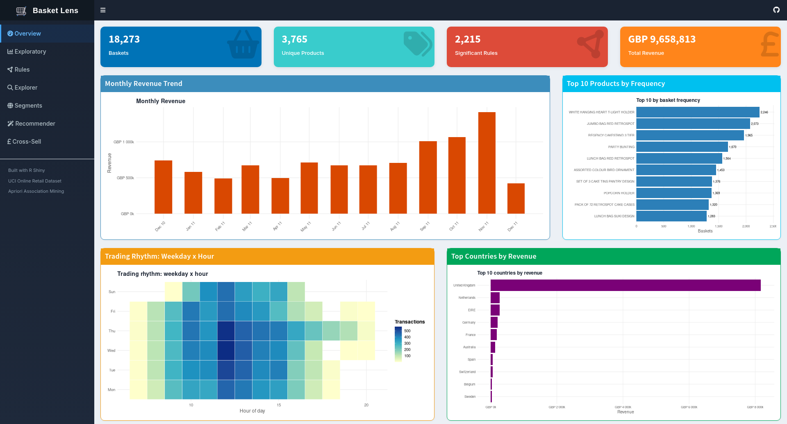

The landing page: four headline counts, then the shape of the business in four
charts. Layout defined at `app.R:171-192`.

## The four KPI boxes

| Box | Value | Server code | Computation | Traces to |
|---|---|---|---|---|
| Baskets | 18,273 | `app.R:471` | `n_distinct(d$retail$InvoiceNo)` | `retail_clean.rds` |
| Unique Products | 3,765 | `app.R:478` | `n_distinct(d$retail$Item)` | `retail_clean.rds` |
| Significant Rules | 2,215 | `app.R:485` | `length(d$sig)` | `rules_significant.rds` |
| Total Revenue | GBP 9,658,813 | `app.R:492` | `sum(d$retail$Revenue)` | `Revenue = Quantity × UnitPrice` |

All four are computed live from the loaded objects, not read from a CSV — which
is why they always agree with whatever is currently in `data/processed/`.

Each is derived in full below.

### KPI 1 — Baskets = 18,273

**Definition.** The number of distinct invoices remaining after cleaning. One
invoice = one shopping basket = one transaction in the Apriori sense.

**Formula.** `N = |{ distinct InvoiceNo }|`

```r
# app.R:471-477
output$ov_baskets <- renderValueBox({
  d <- D(); if (is.null(d) || is.null(d$retail)) return(NULL)
  valueBox(
    format(n_distinct(d$retail$InvoiceNo), big.mark = ","),   # <-- the number
    "Baskets", icon = icon("shopping-basket"), color = "blue"
  )
})
```

**Chain.** raw 25,900 invoices → drop cancellations, admin codes, junk rows →
drop baskets left with a single item (`01_load_clean.R:100-102`) → **18,273**.

**Why it matters.** This is the `N` in every support calculation on the
dashboard. If anyone asks "18,273 out of what?", the answer is 25,900 raw
invoices, reduced by cleaning and by the ≥2-items rule.

**Check.** 16,506 UK + 1,767 international = 18,273 ✓ (Segments tab).
6,139 festive + 12,134 rest-of-year = 18,273 ✓ (Seasonal tab).

### KPI 2 — Unique Products = 3,765

**Definition.** Distinct *canonical* item names, not distinct stock codes.

**Formula.** `|{ distinct Item }|`

```r
# app.R:478-484
valueBox(format(n_distinct(d$retail$Item), big.mark = ","), "Unique Products", ...)
```

**Chain.** `Item` is not a raw column — it is built at
`R/01_load_clean.R:88-97`. The same `StockCode` appears with drifting
descriptions, so the most frequent description per code is elected as the label:

```r
canonical <- retail |>
  dplyr::count(StockCode, Description, name = "n") |>   # L89  every code/label pair
  dplyr::group_by(StockCode) |>
  dplyr::slice_max(n, n = 1, with_ties = FALSE) |>      # L91  the winner
  dplyr::ungroup() |>
  dplyr::select(StockCode, Item = Description)          # L93  becomes `Item`

retail <- retail |> dplyr::left_join(canonical, by = "StockCode")   # L96
```

**Why 3,765 and not the raw 4,070 stock codes.** Admin codes were removed, junk
descriptions were removed, and any two codes that resolve to the same winning
description collapse into one `Item`. Every association rule on this dashboard
is expressed in `Item`, so this is the correct denominator for "products".

### KPI 3 — Significant Rules = 2,215

**Definition.** Association rules that survived all four filters: minimum
support, minimum confidence, lift > 1, non-redundant, and BH-adjusted
p < 0.05.

**Formula.** `length(sig_rules)`

```r
# app.R:485-491
valueBox(format(length(d$sig), big.mark = ","), "Significant Rules", ...)
```

`d$sig` is the object `rules_significant.rds`, written at
`R/03_apriori.R:168`. The full pipeline that produced it is derived under
[Tab 3 — Rules](#tab-3--rules): 2,229 raw → 2,215 after redundancy removal →
2,215 after the significance test.

### KPI 4 — Total Revenue = GBP 9,658,813

This is the number most likely to be challenged, so here is the whole chain.

**Definition.** The sum of `Quantity × UnitPrice` over every line item that
survived cleaning. It is *gross merchandise value on retained lines* — not
turnover, not net of returns, not the retailer's audited accounts.

**Formula.**

```
Revenue_i = Quantity_i × UnitPrice_i          for each surviving line item i
Total     = Σ Revenue_i   over all 515,784 lines
```

**Step 1 — the column is created once**, at `R/01_load_clean.R:80`, *after* all
eight filters have run:

```r
dplyr::mutate(
  Revenue = Quantity * UnitPrice,   # R/01_load_clean.R:80
  ...
)
```

**Step 2 — the KPI sums it**, at `app.R:492-498`:

```r
output$ov_revenue <- renderValueBox({
  d <- D(); if (is.null(d) || is.null(d$retail)) return(NULL)
  valueBox(
    paste0("GBP ", format(round(sum(d$retail$Revenue)), big.mark = ",")),
    #               ^^^^^ round to whole pounds   ^^^^^^^^^^^^ 9658813 -> "9,658,813"
    "Total Revenue", icon = icon("pound-sign"), color = "orange"
  )
})
```

The unrounded value is **9,658,812.83**; `round()` at line 495 makes it
9,658,813 and `format(big.mark = ",")` inserts the separators. Nothing else is
applied — no currency conversion, no discounting.

**What has been excluded before the sum, and where.** Say this list out loud if
asked why the figure differs from the raw file:

| Excluded | Line | Effect on revenue |
|---|---|---|
| Rows with no description | `01:68` | removes unlabelled sales |
| Cancelled invoices (`C…`) | `01:69` | removes negative-revenue reversals |
| `Quantity <= 0` or `UnitPrice <= 0` | `01:70` | removes returns and zero-priced giveaways |
| Postage / fees / admin codes | `01:71` | **removes non-merchandise income** |
| Junk descriptions (damaged, lost, adjust…) | `01:76` | removes stock-adjustment rows |
| Repeat lines of the same product in one invoice | `01:78` | keeps only the first line's revenue |
| Single-item baskets | `01:100-102` | removes baskets that cannot form a rule |

**Two independent cross-checks** — both are recomputed by different code paths,
from different aggregations, and both land on the same figure:

| Cross-check | Sum | Code |
|---|---:|---|
| Σ of the 13 monthly bars | 9,658,812.83 | `02_eda.R:73-77` |
| Σ of all 38 country rows | 9,658,812.83 | `02_eda.R:105-111` |
| Overview KPI | 9,658,812.83 | `app.R:495` |

If the examiner asks "prove it", add up the Monthly Revenue Trend table below —
it reconciles to the penny, because both are `sum(Revenue)` over the same
column, grouped differently.

## Monthly Revenue Trend

**Code:** `plotOutput` at `app.R:180`, `renderPlot` at `app.R:500-511`.
**Data:** `output/tables/02_monthly_sales.csv`.

**How each bar height is calculated.**

**Definition.** Bar height = total revenue of every line item whose invoice date
falls in that calendar month. The `Transactions` column beside it is the count
of *distinct invoices* in the month, not the number of line items.

**Formula.** `Revenue(m) = Σ Revenue_i  for all i where Month_i = m`

Step 1 — the month label is derived from the timestamp
(`R/01_load_clean.R:82`): `Month = lubridate::floor_date(Date, "month")`, so
every date in November 2011 becomes `2011-11-01`.

Step 2 — the aggregation, `R/02_eda.R:73-77`:

```r
monthly <- retail |>
  dplyr::group_by(Month) |>
  dplyr::summarise(Revenue      = sum(Revenue),                 # bar height
                   Transactions = dplyr::n_distinct(InvoiceNo), # invoices that month
                   .groups = "drop")
save_tab(monthly, "02_monthly_sales")
```

Step 3 — the app only *draws* it; it computes nothing (`app.R:500-509`):

```r
d$monthly %>%
  mutate(Month = as.Date(Month)) %>%
  ggplot(aes(Month, Revenue)) +
  geom_col(fill = "#D94801", width = 18) +
  scale_y_continuous(labels = label_number(prefix = "GBP ", scale = 1e-3, suffix = "k"))
```

`scale = 1e-3` is why the axis reads "GBP 1,411k" rather than 1,411,515 — a
display transform only, applied at `app.R:506`.

**Check.** The 13 bars sum to 9,658,812.83 = the Total Revenue KPI ✓, and the
13 `Transactions` values sum to 18,273 = the Baskets KPI ✓.

The exact bar heights:

| Month | Revenue (GBP) | Transactions |
|---|---:|---:|
| Dec 2010 | 743,644 | 1,386 |
| Jan 2011 | 579,439 | 999 |
| Feb 2011 | 490,179 | 1,014 |
| Mar 2011 | 672,982 | 1,343 |
| Apr 2011 | 497,564 | 1,138 |
| May 2011 | 713,477 | 1,523 |
| Jun 2011 | 672,480 | 1,394 |
| Jul 2011 | 672,545 | 1,349 |
| Aug 2011 | 707,742 | 1,230 |
| **Sep 2011** | **1,007,538** | 1,714 |
| **Oct 2011** | **1,068,787** | 1,858 |
| **Nov 2011** | **1,411,515** | 2,567 |
| Dec 2011 | 420,922 | 758 |

**What it says.** Revenue roughly doubles into the Christmas run-up: November
alone (1.41M) is 2.9× February (0.49M). This is a wholesale giftware business,
and Q4 is the whole game.

**The final bar is not a crash.** December 2011 looks like a collapse only
because the dataset stops on **9 December 2011** — it is nine days, not a month.
Reading it as a demand fall-off is the most common misreading of this chart.

The Sep–Nov bulge is what motivates the seasonal split on the Segments tab.

## Top 10 Products by Frequency

**Code:** `app.R:182` / `app.R:512-525`.
**Data:** first 10 rows of `output/tables/02_top50_items_by_frequency.csv`.

**How the bar length and the Support column are calculated.**

**Definition.** `Baskets` is the number of *distinct invoices that contain the
product at least once* — not units sold, and not line-item count. `Support` is
that count expressed as a fraction of all baskets.

**Formula.** `Baskets(item) = |{ invoices containing item }|`,
`Support(item) = Baskets(item) / 18,273`

`R/02_eda.R:11-16`:

```r
top_items <- retail |>
  dplyr::count(Item, name = "Baskets") |>                                  # L12
  dplyr::mutate(Support = Baskets / dplyr::n_distinct(retail$InvoiceNo)) |># L13
  dplyr::arrange(dplyr::desc(Baskets))                                     # L14

save_tab(head(top_items, 50), "02_top50_items_by_frequency")               # L16
```

`count(Item)` counts *rows*, and a plain row count equals a basket count only
because `01_load_clean.R:78` already collapsed each (invoice, product) pair to
one row. **That single `distinct()` is what makes this a support count rather
than a units count** — worth saying if asked why no `n_distinct(InvoiceNo)`
appears here.

The app takes the first 10 rows and draws them (`app.R:512-524`); the
`geom_text` label at `app.R:518` is the same `Baskets` value printed on the bar.

**Check.** Row 1: 2,246 ÷ 18,273 = 0.12291 = the `Support` column ✓.

| Rank | Product | Baskets | Support |
|---|---|---:|---:|
| 1 | WHITE HANGING HEART T-LIGHT HOLDER | 2,246 | 0.1229 |
| 2 | JUMBO BAG RED RETROSPOT | 2,073 | 0.1134 |
| 3 | REGENCY CAKESTAND 3 TIER | 1,965 | 0.1075 |
| 4 | PARTY BUNTING | 1,670 | 0.0914 |
| 5 | LUNCH BAG RED RETROSPOT | 1,564 | 0.0856 |
| 6 | ASSORTED COLOUR BIRD ORNAMENT | 1,453 | 0.0795 |
| 7 | SET OF 3 CAKE TINS PANTRY DESIGN | 1,376 | 0.0753 |
| 8 | POPCORN HOLDER | 1,369 | 0.0749 |
| 9 | PACK OF 72 RETROSPOT CAKE CASES | 1,320 | 0.0722 |
| 10 | LUNCH BAG SUKI DESIGN | 1,283 | 0.0702 |

Support is simply `Baskets / 18,273`. The top product appears in 12.3% of all
baskets — and note that **no single product reaches even 13%**. That long, flat
tail is why a 1% support threshold is not as permissive as it sounds.

## Trading Rhythm: Weekday × Hour

**Code:** `app.R:186` / `app.R:526-537`.
**Data:** computed live in the app, not read from a CSV.

**How each tile's colour value is calculated.**

**Definition.** Tile value = the number of distinct invoices placed in that
(weekday, hour) cell. It is a transaction count, not a revenue or units figure.

**Formula.** `Transactions(w, h) = |{ distinct InvoiceNo with Weekday = w and Hour = h }|`

```r
# app.R:526-535
d$retail %>%
  distinct(InvoiceNo, Weekday, Hour) %>%        # L529  one row per invoice
  count(Weekday, Hour, name = "Transactions") %>%   # L530  the tile value
  ggplot(aes(x = Hour, y = Weekday, fill = Transactions)) +
  geom_tile(colour = "white") +
  scale_fill_distiller(palette = "YlGnBu", direction = 1, labels = comma)
```

`distinct()` on line 529 is doing the real work: without it, a 300-line
wholesale order would count 300 times and the heatmap would show order *size*
rather than order *frequency*. The inputs come from `01_load_clean.R:83-84`,
where `Hour = lubridate::hour(InvoiceDate)` and
`Weekday = lubridate::wday(Date, label = TRUE, week_start = 1)` — `week_start = 1`
is why the axis begins at Monday.

Identical logic produces the static figure `05_weekday_hour_heatmap.png` at
`R/02_eda.R:91-93`.

**What it says.** Trading is concentrated Monday–Friday, roughly 09:00–15:00,
peaking around midday Wednesday–Thursday. Two things to notice:

- **There is no Saturday row at all.** The axis runs Mon, Tue, Wed, Thu, Fri,
  Sun. The retailer simply never records a Saturday order in this dataset — the
  row is absent, not empty.
- Sunday trades, but thinly and over a shorter window.

This is B2B wholesale behaviour: buyers order from an office, during office
hours.

## Top Countries by Revenue

**Code:** `app.R:188` / `app.R:538-549`.
**Data:** `output/tables/02_by_country.csv`, sorted descending, first 10.

**How the three columns are calculated.**

**Definition.** `Transactions` = distinct invoices billed to that country;
`Revenue` = sum of line-item revenue for those invoices; `Share` = that
country's revenue divided by total revenue across all 38 countries.

**Formula.**
`Revenue(c) = Σ Revenue_i for Country_i = c`,
`Share(c) = Revenue(c) / Σ_all Revenue`

`R/02_eda.R:105-111`:

```r
by_country <- retail |>
  dplyr::group_by(Country) |>
  dplyr::summarise(Transactions = dplyr::n_distinct(InvoiceNo),   # L107
                   Revenue      = sum(Revenue), .groups = "drop") |>  # L108
  dplyr::arrange(dplyr::desc(Revenue)) |>
  dplyr::mutate(RevenueShare = Revenue / sum(Revenue))             # L110
save_tab(by_country, "02_by_country")
```

The app re-sorts and slices to ten (`app.R:540`):
`head(arrange(d$by_country, desc(Revenue)), 10)`. **The share column is computed
over all 38 countries, then the top 10 are displayed** — so the ten visible
shares deliberately do not sum to 100%.

**Check.** UK: 8,169,433.72 ÷ 9,658,812.83 = 0.8458 = 84.6% ✓. All 38 country
revenues sum to 9,658,812.83 = the Total Revenue KPI ✓, and the 38
`Transactions` values sum to 18,273 ✓ (a country is a property of the invoice,
so no basket is split across two countries).

The per-basket figures quoted below are hand-derived from these two columns,
not computed by the app: 8,169,434 ÷ 16,506 = GBP 494.94 for the UK, and
273,284 ÷ 80 = GBP 3,416.06 for the Netherlands.

| Country | Transactions | Revenue (GBP) | Share |
|---|---:|---:|---:|
| United Kingdom | 16,506 | 8,169,434 | **84.6%** |
| Netherlands | 80 | 273,284 | 2.83% |
| EIRE | 266 | 269,712 | 2.79% |
| Germany | 426 | 204,099 | 2.11% |
| France | 366 | 182,378 | 1.89% |
| Australia | 47 | 134,466 | 1.39% |
| Spain | 86 | 55,533 | 0.57% |
| Switzerland | 47 | 52,609 | 0.54% |
| Belgium | 96 | 36,832 | 0.38% |
| Sweden | 29 | 35,196 | 0.36% |

**What it says.** One bar dominates and the other nine are slivers. The UK is
84.6% of revenue on 16,506 of 18,273 baskets.

Look at the *ratio* though: the Netherlands turns 80 baskets into GBP 273k —
about GBP 3,400 per basket, against roughly GBP 495 per UK basket. A handful of
very large export orders. This asymmetry is exactly why the Segments tab has to
mine the two markets separately with different support thresholds.

---

# Tab 2 — Exploratory

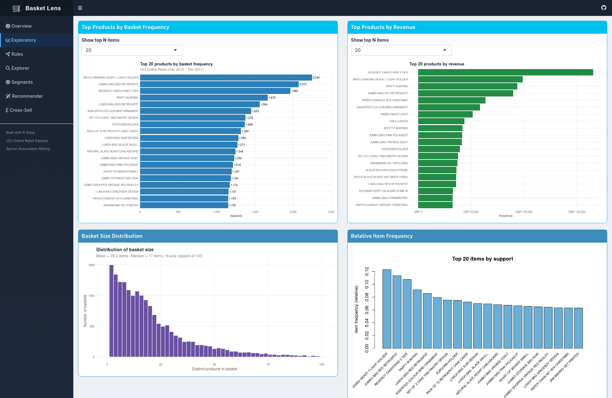

Four views of the cleaned data before any rule mining. Layout at `app.R:195-213`.

## Top Products by Basket Frequency (interactive)

**Control:** `selectInput("eda_freq_n")` at `app.R:198` — choices 10, 15, 20,
25, 30, 50, default 20.
**Code:** `app.R:200` / `app.R:553-568`.
**Data:** `head(02_top50_items_by_frequency.csv, n)`.

This is the same data as the Overview's Top 10, extended. Ranks 11-20:

| Rank | Product | Baskets |
|---|---|---:|
| 11 | LUNCH BAG BLACK SKULL | 1,271 |
| 12 | NATURAL SLATE HEART CHALKBOARD | 1,248 |
| 13 | JUMBO BAG VINTAGE DOILY | 1,230 |
| 14 | JUMBO BAG PINK POLKADOT | 1,216 |
| 15 | HEART OF WICKER SMALL | 1,197 |
| 16 | JUMBO STORAGE BAG SUKI | 1,184 |
| 17 | JUMBO SHOPPER VINTAGE RED PAISLEY | 1,174 |
| 18 | LUNCH BAG SPACEBOY DESIGN | 1,157 |
| 19 | PAPER CHAIN KIT 50'S CHRISTMAS | 1,153 |
| 20 | JAM MAKING SET PRINTED | 1,152 |

**Why the dropdown stops at 50:** the CSV holds exactly 50 rows
(`save_tab(head(top_items, 50), ...)` in `R/02_eda.R`). Asking for more than
50 would show nothing extra, so the choice list is capped to match.

**What it says.** The curve is remarkably flat — rank 1 is 2,246 and rank 20 is
still 1,152. There is no runaway bestseller; the business is broad.

## Top Products by Revenue (interactive)

**Control:** `selectInput("eda_rev_n")` at `app.R:202`.
**Code:** `app.R:204` / `app.R:569-581`.
**Data:** `head(02_top50_items_by_revenue.csv, n)`.

**How each bar is calculated.**

**Definition.** Bar length = every pound this product earned across the whole
year: sum of `Quantity × UnitPrice` over all its surviving line items. The
companion `Units` column is total pieces sold.

**Formula.** `Revenue(item) = Σ (Quantity_i × UnitPrice_i)` over rows with that
`Item`; `Units(item) = Σ Quantity_i`

`R/02_eda.R:31-35`:

```r
top_revenue <- retail |>
  dplyr::group_by(Item) |>
  dplyr::summarise(Revenue = sum(Revenue),      # L33  bar length
                   Units   = sum(Quantity),     # L33  pieces sold
                   .groups = "drop") |>
  dplyr::arrange(dplyr::desc(Revenue))          # L34
save_tab(head(top_revenue, 50), "02_top50_items_by_revenue")
```

**The contrast with the chart on the left, stated precisely.** Both are grouped
by `Item`; only the aggregate differs — `count()` (rows, i.e. baskets) on the
left versus `sum(Revenue)` (money) here. That one substitution is the entire
reason the rankings disagree.

**Check.** REGENCY CAKESTAND 3 TIER: GBP 165,394.06 from 13,048 units →
implied average line value 165,394.06 ÷ 13,048 = GBP 12.68 per unit, against
WHITE HANGING HEART's 98,952.18 ÷ 35,046 = GBP 2.82. Nearly 4.5× the unit
value on a quarter of the volume — that is why an item ranked 3rd by frequency
is 1st by revenue.

**Read this chart against the one on its left — that is the whole point of the
pairing.** The ordering changes:

| Product | Rank by frequency | Rank by revenue |
|---|---:|---:|
| REGENCY CAKESTAND 3 TIER | 3 | **1** |
| WHITE HANGING HEART T-LIGHT HOLDER | 1 | 2 |
| PARTY BUNTING | 4 | 3 |
| JUMBO BAG RED RETROSPOT | 2 | 4 |
| RABBIT NIGHT LIGHT | outside top 20 | 7 |
| CHILLI LIGHTS | outside top 20 | 8 |

REGENCY CAKESTAND 3 TIER appears in fewer baskets than the t-light holder but
earns more, because it is an expensive item (average unit price GBP 13.98 —
see the Cross-Sell table). RABBIT NIGHT LIGHT and CHILLI LIGHTS make the
revenue top ten without being frequent at all.

**Why this matters for the rest of the dashboard:** Apriori ranks by
*frequency*, so the rules it finds are about the cheap, high-volume items.
Frequency and value are different questions, and the Cross-Sell tab exists to
bolt price back on.

## Basket Size Distribution

**Code:** `app.R:208` / `app.R:582-595`.
**Data:** computed live in the app; the printed statistics table comes from
`output/tables/02_basket_size_stats.csv`.

**How the bar heights and the subtitle numbers are calculated.**

**Definition.** `BasketSize` = the number of *distinct products* in one invoice.
The histogram's y-axis is then the number of baskets falling in each 2-product
bin.

**Formula.** `BasketSize(inv) = |{ distinct products in inv }|`, binned at
width 2.

```r
# app.R:582-593
bs <- d$retail %>% count(InvoiceNo, name = "BasketSize")   # L584  one row per basket
mn <- round(mean(bs$BasketSize), 1)                        # L585  subtitle mean = 28.2
md <- median(bs$BasketSize)                                # L586  subtitle median = 17
ggplot(bs, aes(BasketSize)) +
  geom_histogram(binwidth = 2, fill = "#6A51A3", colour = "white") +  # L588
  scale_x_continuous(limits = c(0, 100))                              # L589  crops the tail
```

Again `count(InvoiceNo)` counts rows, and rows = distinct products per basket
only because of the `distinct()` at `01_load_clean.R:78`.

The seven-row statistics table is computed once in the pipeline, at
`R/02_eda.R:61-70`, with base-R `quantile()`:

```r
data.frame(Statistic = c("Min","Q1","Median","Mean","Q3","P95","Max"),
           BasketSize = round(c(min(basket_sizes$BasketSize),
                                quantile(basket_sizes$BasketSize, .25),
                                median(basket_sizes$BasketSize),
                                mean(basket_sizes$BasketSize),
                                quantile(basket_sizes$BasketSize, .75),
                                quantile(basket_sizes$BasketSize, .95),
                                max(basket_sizes$BasketSize)), 2))
```

**Check.** Mean = 515,784 rows ÷ 18,273 baskets = 28.23, identical to
`Mean basket size` in the cleaning summary (`01_load_clean.R:117`) ✓ — two
different expressions, same value.

Full statistics from `output/tables/02_basket_size_stats.csv`:

| Statistic | Distinct products in basket |
|---|---:|
| Min | 2 |
| Q1 | 8 |
| Median | 17 |
| Mean | 28.23 |
| Q3 | 30 |
| P95 | 78.4 |
| Max | **1,106** |

**What it says.** A textbook right-skewed distribution. Mean (28.2) sits well
above median (17) because a small number of enormous wholesale orders drag the
average up — the largest single basket holds 1,106 distinct products.

**Two things the chart hides.** The x-axis is capped at 100
(`scale_x_continuous(limits = c(0, 100))`), so roughly the top 2-3% of baskets
are silently dropped from the plot; ggplot removes them rather than compressing
the axis. And the minimum is 2, not 1, because single-item baskets were removed
during cleaning.

## Relative Item Frequency  *(static image)*

**Code:** `show_fig("07_item_frequency_relative.png")` at `app.R:210`.
**Produced by:** `R/03_apriori.R`, using `arules::itemFrequencyPlot()` — base R
graphics written straight to PNG, which is why it is a fixed image and looks
different from the ggplot panels around it.

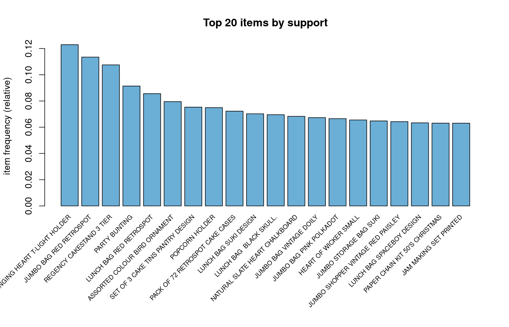

**What it says.** The same top 20 items, but on the *support* scale that Apriori
actually uses — the y-axis reads 0.12 down to about 0.06. Put the horizontal
line of the 0.01 support threshold mentally at the very bottom of this chart:
every item shown is far above it. The threshold's real work is excluding the
other ~3,745 products, not these.

---

# Tab 3 — Rules

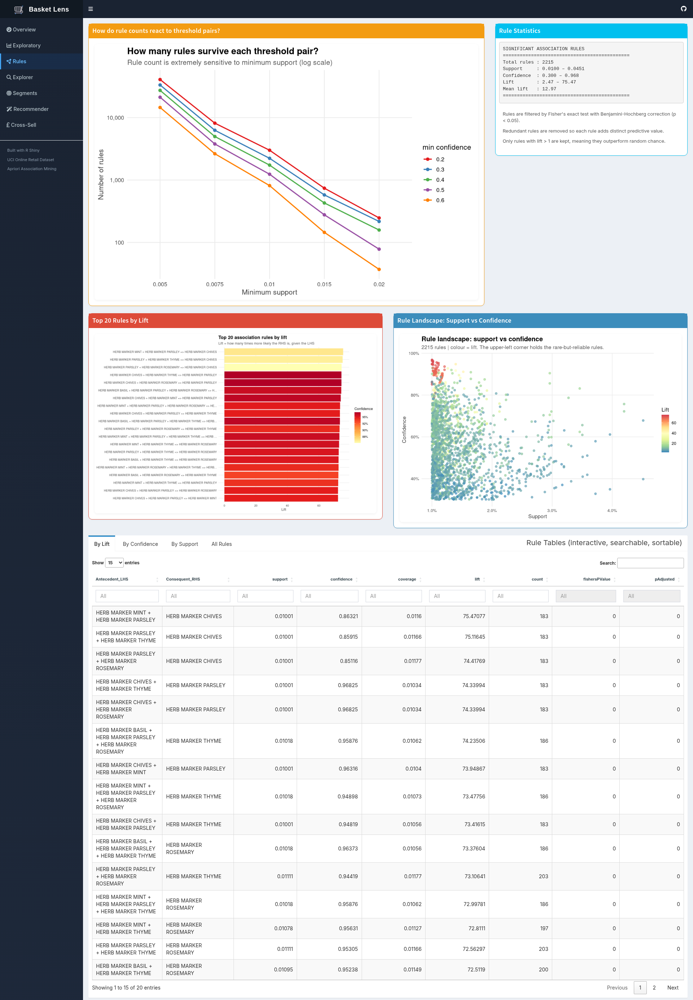

Where the association rules themselves appear. Layout at `app.R:217-246`.

## How do rule counts react to threshold pairs?  *(static image)*

**Code:** `show_fig("08_threshold_sensitivity.png")` at `app.R:221`.
**Produced by:** `R/03_apriori.R:142-152`, which runs Apriori **25 separate
times** over a grid of 5 support × 5 confidence values and records `length(r)`
each time. Saved to `output/tables/03_threshold_sensitivity.csv`.

**How each cell is calculated.** There is no formula — each number is the
literal output of re-running the algorithm at that threshold pair:

```r
grid <- expand.grid(support    = c(0.005, 0.0075, 0.01, 0.015, 0.02),   # L142
                    confidence = c(0.2, 0.3, 0.4, 0.5, 0.6))            # L143
grid$n_rules <- mapply(function(s, c_) {
  r <- arules::apriori(trans,
        parameter = list(support = s, confidence = c_,
                         minlen = 2, maxlen = PARAMS$maxlen),
        control = list(verbose = FALSE))
  length(r)                              # L150  <-- the cell value
}, grid$support, grid$confidence)
save_tab(grid, "03_threshold_sensitivity")                              # L152
```

Note the cells are counts of **raw** rules: this loop applies neither the
`lift > 1` filter, the redundancy removal, nor the significance test. That is
why the 0.010 / 0.3 cell reads 2,229 while the dashboard's headline is 2,215.

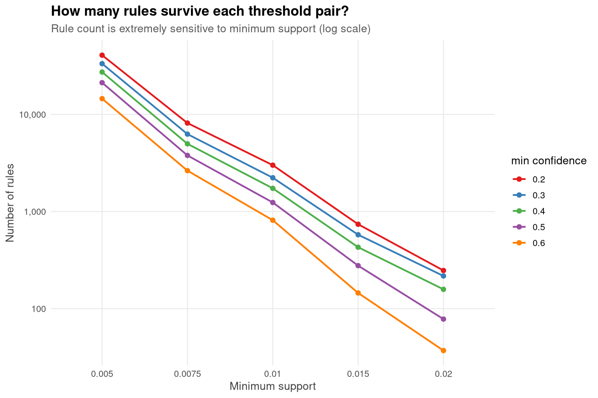

The full grid, in numbers:

| min support ↓ / min confidence → | 0.2 | 0.3 | 0.4 | 0.5 | 0.6 |
|---|---:|---:|---:|---:|---:|
| **0.005** | 40,787 | 33,360 | 27,333 | 21,245 | 14,545 |
| **0.0075** | 8,155 | 6,272 | 4,982 | 3,784 | 2,638 |
| **0.010** | 3,003 | **2,229** | 1,734 | 1,239 | 814 |
| **0.015** | 740 | 577 | 429 | 277 | 145 |
| **0.020** | 247 | 217 | 158 | 78 | 37 |

**What it says — and this is the most important chart on the dashboard for
defending the method.** The y-axis is logarithmic, and the lines are steep and
near-parallel. Compare the two directions:

- Move **support** from 0.005 to 0.02 (4× stricter), holding confidence at 0.3:
  33,360 → 217 rules. A **154-fold** reduction.
- Move **confidence** from 0.2 to 0.6 (3× stricter), holding support at 0.01:
  3,003 → 814 rules. A **3.7-fold** reduction.

Support is the parameter that matters, by roughly two orders of magnitude. The
reason is the Apriori property itself: raising support prunes *itemsets* before
any rules are generated, so it cuts the combinatorial search space. Confidence
only filters rules that have already been generated.

The chosen operating point is support 0.01 / confidence 0.3 — the highlighted
cell, 2,229 raw rules. Choosing 0.005 instead would have produced 33,360, far
too many to inspect; choosing 0.02 would have produced 217, mostly obvious.

## Rule Statistics

**Code:** `verbatimTextOutput("rules_stats")` at `app.R:223`, `renderPrint` at
`app.R:599-615`.
**Data:** computed live from `quality(d$sig)`.

```
SIGNIFICANT ASSOCIATION RULES
=============================================
Total rules : 2215
Support     : 0.0100 – 0.0451
Confidence  : 0.300 – 0.968
Lift        : 2.47 – 75.47
Mean lift   : 12.97
=============================================
```

**How each line of that box is calculated.** Nothing here is read from a file —
`quality()` returns the measures `arules` attached to each rule, and the app
takes six summary statistics off that data frame (`app.R:605-613`):

```r
cat(sprintf("Total rules : %d\n", length(d$sig)))                       # L607
q <- quality(d$sig)                                                      # L608
cat(sprintf("Support     : %.4f – %.4f\n", min(q$support),    max(q$support)))     # L609
cat(sprintf("Confidence  : %.3f – %.3f\n", min(q$confidence), max(q$confidence)))  # L610
cat(sprintf("Lift        : %.2f – %.2f\n", min(q$lift),       max(q$lift)))        # L611
cat(sprintf("Mean lift   : %.2f\n", mean(q$lift)))                       # L612
```

**Where `q$support`, `q$confidence` and `q$lift` come from.** They are computed
inside `arules::apriori()` at `R/03_apriori.R:80-88`, over the transaction
object built at `R/03_apriori.R:18-21`. For a rule X ⇒ Y and N = 18,273
baskets:

| Measure | Definition in words | Formula | Counted as |
|---|---|---|---|
| `support` | share of all baskets holding **both** sides | supp(X ∪ Y) = count(X ∪ Y) / N | `count` ÷ 18,273 |
| `confidence` | of the baskets holding X, the share that also hold Y | supp(X ∪ Y) / supp(X) | conditional probability P(Y\|X) |
| `coverage` | share of baskets the rule applies to at all | supp(X) | denominator of confidence |
| `lift` | how many times better than chance | confidence / supp(Y) | 1 = independent |
| `count` | absolute baskets holding both sides | supp(X ∪ Y) × N | integer |

**Worked example on the highest-support rule** (`03_top_rules_by_support.csv`,
row 1) — `{JUMBO BAG PINK POLKADOT} ⇒ {JUMBO BAG RED RETROSPOT}`:

```
count       = 825 baskets hold both bags
support     = 825 / 18,273            = 0.04515   ✓ matches the table
coverage    = supp(PINK POLKADOT)     = 0.06655   (1,216 / 18,273)
confidence  = 0.04515 / 0.06655       = 0.67845   ✓
supp(RED RETROSPOT) = 2,073 / 18,273  = 0.11345   (Overview top-10 table)
lift        = 0.67845 / 0.11345       = 5.98      ✓
```

Every number in that block is on this page already: 825 from the rule table,
1,216 and 2,073 from the Exploratory frequency table, 18,273 from the Overview
KPI. That is the full derivation of a rule, end to end, with no hidden step.

Read the bounds as confirmation that the filters did their job: minimum support
is exactly 0.0100 and minimum confidence exactly 0.300 — the thresholds — while
minimum **lift is 2.47**, comfortably above the `lift > 1` cut. Not one surviving
rule is merely marginally better than chance.

**How 2,229 became 2,215** (`R/03_apriori.R:88-113`):

| Stage | Rules | Code |
|---|---:|---|
| Raw Apriori at supp 0.01 / conf 0.3 | 2,229 | `apriori(...)` |
| After `lift > 1` | (unchanged in practice) | `subset(rules, lift > PARAMS$min_lift)` |
| After removing redundant rules | 2,215 | `rules[!is.redundant(rules)]` |
| After Fisher + BH, p < 0.05 | **2,215** | `subset(rules, pAdjusted < 0.05)` |

A rule is **redundant** when a more general rule — one whose antecedent is a
subset — already achieves at least the same confidence. The extra condition
earns nothing, so it is dropped.

**The statistical test removed exactly zero rules.** Each rule gets a Fisher's
exact test on its 2×2 contingency table, and the p-values are corrected for
multiple testing with Benjamini-Hochberg. All 2,215 survived at p < 0.05. That
is not a bug — with 18,273 baskets, a rule that already clears support 1% and
lift 2.47 has overwhelming evidence behind it. Worth stating plainly if you are
asked: the test is a guard that did not need to fire, not a filter doing work.

The three explanatory lines in the blue box to the right (`app.R:225-229`) are
static text describing exactly this.

## Top 20 Rules by Lift  *(static image)*

**Code:** `show_fig("14_top_rules_by_lift_bars.png")` at `app.R:231`.
**Produced by:** `R/04_visualize_rules.R`, bar length = lift, fill = confidence.

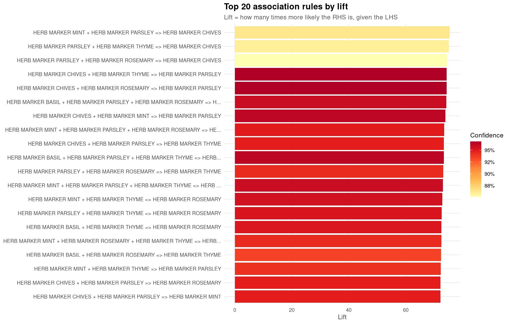

**What it says.** Every one of the top 20 rules is a HERB MARKER rule. The set
is BASIL, CHIVES, MINT, PARSLEY, ROSEMARY, THYME, and the rules are combinations
like `{MINT, PARSLEY} => {CHIVES}` at lift 75.47.

This is the single most striking result on the dashboard, and it needs the right
interpretation. A lift of 75 means the consequent is 75× more likely than
baseline — but these are **six variants of one product sold as a set**. The
algorithm has rediscovered the product range, not a customer behaviour. It is a
genuine pattern and a correct result; it is simply not an actionable one, since
nobody needs an algorithm to suggest the sixth herb marker to someone buying
five.

This is why the Cross-Sell tab ranks by *money* rather than lift — and note that
not one herb marker appears in its top 15.

## Rule Landscape: Support vs Confidence  *(static image)*

**Code:** `show_fig("09_rules_scatter.png")` at `app.R:234`.
**Produced by:** `R/04_visualize_rules.R`, one point per rule, colour = lift.

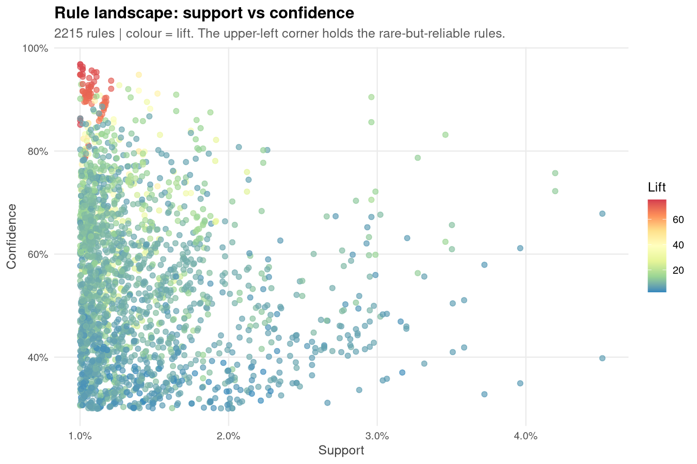

**How to read it.** All 2,215 rules plotted at once: x = support (1.0%-4.5%),
y = confidence (30%-97%), colour = lift (blue low, red high).

- The **left edge is a wall.** Nothing exists left of 1.0% support — that is the
  threshold, drawn by its own absence.
- The **upper-left cluster is red.** High confidence, low support, very high
  lift: the rare-but-reliable rules. That red cluster is the herb markers.
- The **right side is blue and low.** Rules with high support (4%+) sit at 40-60%
  confidence and lift under 10 — the popular-item rules like
  `{LUNCH BAG RED RETROSPOT} => {JUMBO BAG RED RETROSPOT}`.

The trade-off is visible as a shape: you can have a rule that fires often, or a
rule that is nearly always right, rarely both. Lift and support pull against
each other because lift divides by the consequent's own frequency.

## Rule Tables (four tabs)

**Code:** `tabBox` at `app.R:237-242`; the four `renderDT` blocks at
`app.R:616-641`.

| Tab | Output id | CSV | Rows |
|---|---|---|---:|
| By Lift | `tab_lift` | `03_top_rules_by_lift.csv` | 20 |
| By Confidence | `tab_conf` | `03_top_rules_by_confidence.csv` | 20 |
| By Support | `tab_supp` | `03_top_rules_by_support.csv` | 20 |
| All Rules | `tab_all` | `03_all_significant_rules.csv` | **2,215** |

The first three are pre-sorted top-20 extracts written by `R/03_apriori.R:120-127`;
only "All Rules" contains the complete set. All four are DataTables with
`filter = "top"` (the per-column search boxes) and `scrollX = TRUE`.

The columns are the standard `arules` quality measures plus the two added by the
significance step:

| Column | Meaning |
|---|---|
| `support` | P(LHS ∩ RHS) — fraction of all baskets holding both |
| `confidence` | P(RHS \| LHS) — how often the rule is right when it fires |
| `coverage` | P(LHS) — fraction of baskets the rule applies to at all |
| `lift` | confidence ÷ P(RHS) — times better than chance |
| `count` | absolute baskets = support × 18,273 |
| `fishersPValue` | raw p-value from the exact test |
| `pAdjusted` | Benjamini-Hochberg corrected p-value |

**The p-value columns show `0`, and that is a display artefact, not a bug.**
`R/03_apriori.R:134` rounds every numeric column to 5 decimal places
(`round(x, 5)`); the true p-values are far smaller than 1e-5, so they render as
zero. They are not literally zero.

Sanity check on the top row: support 0.01001 × 18,273 = 182.9 ≈ `count` 183. ✓

---

# Tab 4 — Explorer

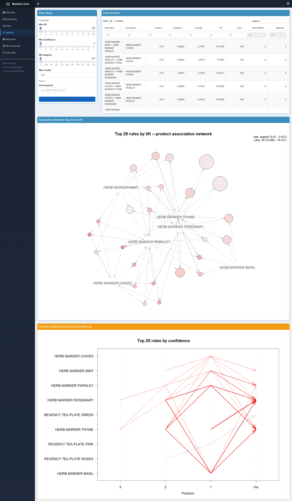

The one genuinely interactive analysis screen: filter all 2,215 rules yourself.
Layout at `app.R:249-274`.

## The filter panel

**Code:** `app.R:251-262`.

| Control | id | Range | Default | Line |
|---|---|---|---|---|
| Min Lift | `exp_min_lift` | 1 → 100, step 0.5 | 1 | `app.R:253` |
| Min Confidence | `exp_min_conf` | 0 → 1, step 0.01 | 0 | `app.R:254` |
| Min Support | `exp_min_supp` | 0 → 0.05, step 0.0005 | 0 | `app.R:255` |
| Max results | `exp_max` | 10 → 2215 | 300 | `app.R:256` |
| Item keyword | `exp_search` | free text | empty | `app.R:258` |
| Apply Filters | `exp_apply` | action button | — | `app.R:260` |

Note the slider *ranges* are chosen to match the data: Min Support tops out at
0.05 because the highest-support rule is 0.0451, and Max results tops out at
2,215 because that is the rule count.

## What happens when you press Apply

**Code:** `observeEvent(input$exp_apply, ...)` at `app.R:644-678`.

The filtering runs on the `arules` rule object directly — not on a data frame —
which is why it stays fast:

```r
q <- quality(d$sig)                                    # 1. pull the measures
keep <- q$lift >= min_lift & q$confidence >= min_conf &
        q$support >= min_supp                          # 2. logical mask
filtered <- d$sig[keep]                                # 3. subset the rules

if (length(filtered) > max_r)                          # 4. cap, sorted by lift
  filtered <- head(sort(filtered, by = "lift", decreasing = TRUE), max_r)

df <- arules::DATAFRAME(filtered, setStart = "", setEnd = "", itemSep = " + ")
names(df)[1:2] <- c("Antecedent", "Consequent")        # 5. convert & rename
df[num] <- lapply(df[num], function(x) round(x, 4))    # 6. round

if (nchar(search) > 0)                                 # 7. keyword filter
  df <- df[grepl(search, paste(df$Antecedent, df$Consequent), ignore.case = TRUE), ]
```

Two behaviours worth knowing:

- **`ignoreNULL = FALSE`** (`app.R:678`) makes the handler fire once at startup,
  which is why the table is already populated with the default 300 rules before
  you touch anything.
- **The cap is applied at step 4, but the keyword search at step 7.** So with
  Max results at its default 300, searching `HEART` searches only within the
  top 300 rules by lift — *not* across all 2,215. Since the top 300 by lift are
  dominated by herb markers, a keyword search can plausibly return nothing while
  matching rules do exist further down. **Raise Max results to 2215 before using
  the keyword box** if you want a true search.

`DATAFRAME(..., setStart = "", setEnd = "", itemSep = " + ")` is what strips the
`{ }` braces and turns `{A,B}` into `A + B` for display.

## Association Network (Top 25 by Lift)  *(static image)*

**Code:** `show_fig("11_rules_graph_top25_lift.png")` at `app.R:268`.
**Produced by:** `R/04_visualize_rules.R` via `arulesViz` with the `igraph` engine.

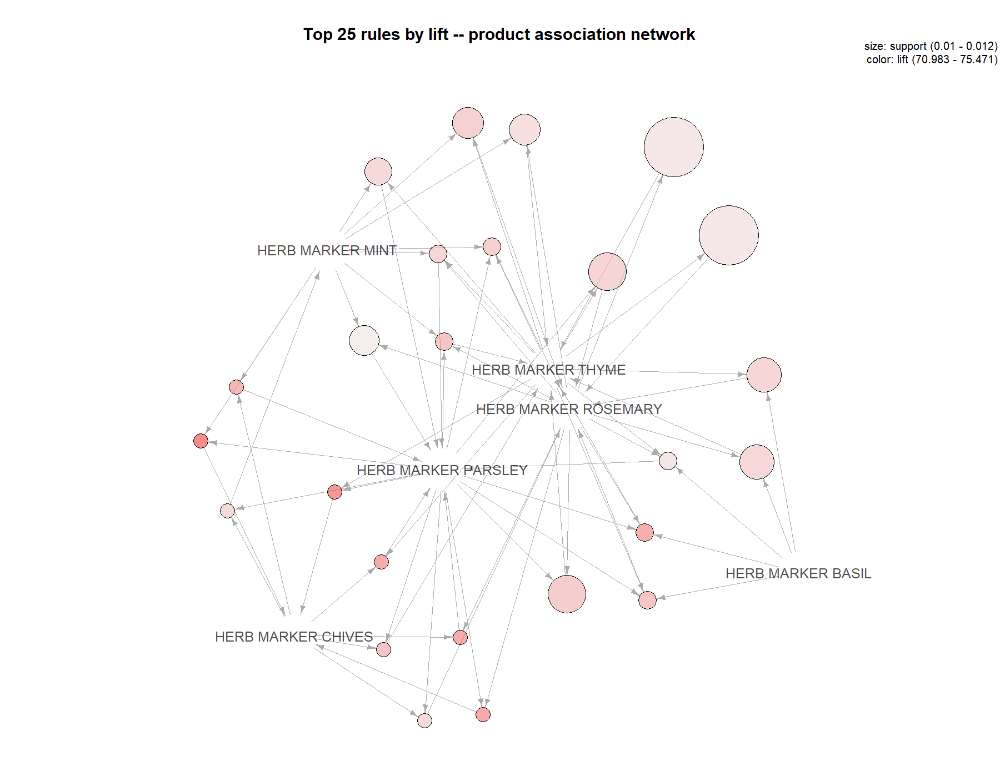

**How to read it.** Two kinds of node. Labelled nodes are *products*; unlabelled
circles are *rules*. Arrows run product → rule → product, so each small circle
is one rule with its antecedents flowing in and its consequent flowing out.
Circle **size** = support, circle **colour** = lift (deeper red = higher).

**What it says.** A single dense clique of six herb markers, every one connected
to every other. Visually this is the clearest possible statement that the
top-lift rules are one product family rather than 25 independent discoveries.

**This picture does not respond to the sliders above it.** It is a fixed PNG of
the top 25 by lift, regenerated only when the pipeline runs.

## Parallel Coordinates (Top 20 by Confidence)  *(static image)*

**Code:** `show_fig("13_rules_paracoord.png")` at `app.R:272`.
**Produced by:** `R/04_visualize_rules.R`, `method = "paracoord"`.

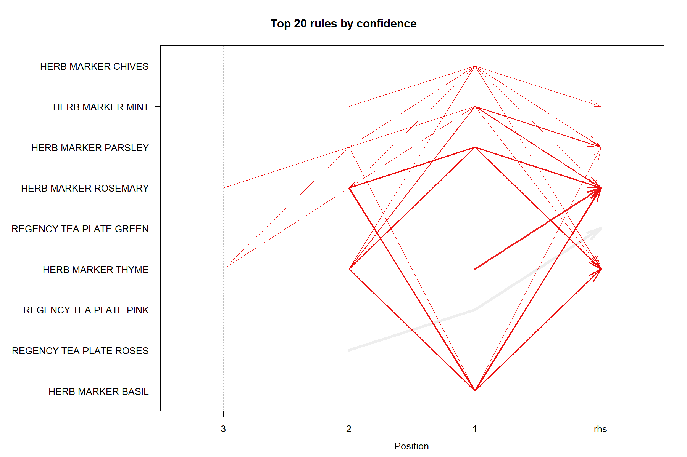

**How to read it.** The x-axis is *position within the rule*, read right to
left: column `1` is the item nearest the arrow, `2` the next, `3` the furthest,
and `rhs` is the consequent. Each line traces one rule from its antecedents into
its consequent; arrow width reflects support.

**What it says.** The herb-marker cluster again, plus the REGENCY TEA PLATE
family (GREEN / PINK / ROSES) entering at position 2-3. Because these are the
top rules by *confidence* rather than lift, the tea plates appear here but not
in the lift-ranked network above — a useful reminder that the two rankings
select different rules.

---

# Tab 5 — Segments

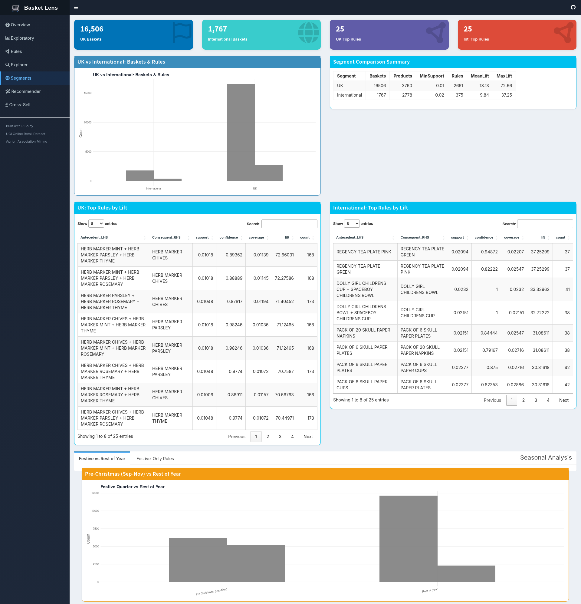

Does the pattern structure change between markets and between seasons? The
answer required re-running Apriori on subsets, in
`R/05_segments_and_recommendations.R`. Layout at `app.R:279-313`.

## The four KPI boxes (Segments)

| Box | Value | Code | Computation |
|---|---|---|---|
| UK Baskets | 16,506 | `app.R:683` | `n_distinct(InvoiceNo[Country == "United Kingdom"])` |
| International Baskets | 1,767 | `app.R:689` | `n_distinct(InvoiceNo[Country != "United Kingdom"])` |
| UK Top Rules | 25 | `app.R:695` | `nrow(d$uk_rules)` |
| Intl Top Rules | 25 | `app.R:700` | `nrow(d$intl_rules)` |

16,506 + 1,767 = 18,273 ✓ — the segments partition the baskets exactly.

**How the two basket counts are calculated.** Both are computed live in the app
by subsetting the invoice column on `Country`, then counting distinct values —
`United Kingdom` versus everything else, with no third category:

```r
# app.R:683-693
n_uk   <- n_distinct(d$retail$InvoiceNo[d$retail$Country == "United Kingdom"])  # L685
n_intl <- n_distinct(d$retail$InvoiceNo[d$retail$Country != "United Kingdom"])  # L691
```

The pipeline draws the same line at `R/05_segments_and_recommendations.R:37`,
which is what makes the app's KPI and the CSV's `Baskets` column agree:

```r
retail$Segment <- ifelse(retail$Country == "United Kingdom", "UK", "International")
```

**How the two "Top Rules" boxes are calculated** — and why they are misleading:

```r
# app.R:695-703
n <- if (nrow(d$uk_rules) > 0 && !"Note" %in% names(d$uk_rules)) nrow(d$uk_rules) else 0
```

`nrow()` of a CSV that `to_df(r, n = 25)` (`R/05_...R:27-28`) already truncated
to 25 rows. It counts rows in a file, not rules in a model.

⚠️ **The two "Top Rules" boxes do not show rule counts.** They show the row
count of `05_top_rules_uk.csv` and `05_top_rules_international.csv`, and those
files are deliberately truncated to the top 25 by `to_df(r, n = 25)`
(`R/05_...R:27`). Both will read "25" regardless of what was actually mined. The
real counts are **2,661 (UK)** and **375 (International)**, and they are sitting
in the comparison table immediately to the right. Read that table, not these two
boxes.

## Segment Comparison Summary

**Code:** `tableOutput` at `app.R:290`, `renderTable` at `app.R:706-710`.
**Data:** `output/tables/05_segment_comparison.csv`.

| Segment | Baskets | Products | MinSupport | Rules | MeanLift | MaxLift |
|---|---:|---:|---:|---:|---:|---:|
| UK | 16,506 | 3,760 | 0.01 | 2,661 | 13.13 | 72.66 |
| International | 1,767 | 2,778 | **0.02** | 375 | 9.84 | 37.25 |

**How every column of that table is calculated.** The whole table is one
`data.frame()` at `R/05_segments_and_recommendations.R:56-67`, filled by
`sapply()` over the two segment results:

| Column | Code (`05_...R`) | Definition |
|---|---|---|
| `Baskets` | `length(x$trans)` — L58 | transactions in that segment's basket object |
| `Products` | `ncol(x$trans)` — L59 | distinct items appearing in it (columns of the incidence matrix) |
| `MinSupport` | `x$support` — L60 | the threshold that mining actually used |
| `Rules` | `length(x$rules)` — L61 | rules left after `lift > 1` and redundancy removal |
| `MeanLift` | `round(mean(quality(x$rules)$lift), 2)` — L62-63 | average lift over those rules |
| `MaxLift` | `round(max(quality(x$rules)$lift), 2)` — L64-65 | the strongest single rule |

Each segment is mined from scratch — the rules are *not* filtered out of the
2,215 global rules. `make_trans()` (L12-16) rebuilds a transaction object from
that segment's invoices only, dropping baskets left with fewer than 2 items,
and `mine()` (L18-25) reruns Apriori on it:

```r
mine <- function(tr, support = PARAMS$support, confidence = PARAMS$confidence) {
  r <- arules::apriori(tr, parameter = list(support = support,
                       confidence = confidence, minlen = 2, maxlen = PARAMS$maxlen),
                       control = list(verbose = FALSE))
  r <- subset(r, lift > 1)                # L23
  r[!arules::is.redundant(r)]             # L24
}
```

**This is why 2,661 + 375 ≠ 2,215.** The segment counts come from two
independent mining runs at two different support thresholds, on two smaller
basket pools — they are not a partition of the global rule set. Baskets
partition; rules do not. Note also that no Fisher/BH significance step is
applied to the segment rules, unlike the global set.

**Why International uses support 0.02 and the UK uses 0.01** — this is a
deliberate methodological choice at `R/05_...R:45`:

```r
sup <- if (s == "UK") PARAMS$support else 0.02
```

At 1% support, International would need only 18 baskets to call a pattern
"frequent" — low enough that noise passes as signal. Raising the bar to 2%
requires 35 baskets. The trade-off is that the two rule sets are no longer
strictly comparable, which is exactly why the `MinSupport` column is printed in
the table rather than hidden.

**What it says.** The UK produces 7× more rules from 9× more baskets, with
higher mean lift (13.13 vs 9.84) *despite* the stricter International threshold.
And the products differ: UK rules are herb markers and jumbo bags; International
rules are REGENCY TEA PLATE sets, DOLLY GIRL / SPACEBOY children's tableware,
and SKULL paper party goods — export buyers purchase complete matching sets.

## UK vs International: Baskets & Rules

**Code:** `plotOutput` at `app.R:288`, `renderPlot` at `app.R:711-723`.
**Data:** `05_segment_comparison.csv`, reshaped with `pivot_longer` on the
`Rules` and `Baskets` columns.

⚠️ **This chart is currently broken, and the same bug hits the seasonal chart
below it.** Both bars render grey and no legend appears, so there is no way to
tell which bar is Baskets and which is Rules. The cause is at `app.R:716-717`:

```r
scale_fill_manual(values = c(Rules   = mba_colors["primary"],
                             Baskets = mba_colors["orange"]))
```

`mba_colors` is a *named* vector (`app.R:41-50`), so `mba_colors["primary"]`
carries the name `primary` with it. Wrapping that in `c(Rules = ...)` produces
the compound name `Rules.primary`, not `Rules`:

```r
> names(c(Rules = mba_colors["primary"], Baskets = mba_colors["orange"]))
[1] "Rules.primary"  "Baskets.orange"
```

Those names never match the factor levels `Rules` / `Baskets`, so ggplot finds
no colour for either group and falls back to grey with the legend suppressed.
The one-line fix is to strip the names with `unname()`:

```r
scale_fill_manual(values = c(Rules   = unname(mba_colors["primary"]),
                             Baskets = unname(mba_colors["orange"])))
```

The same fix applies at `app.R:742-743` for `season_bar`.

Until then, read the values from the summary table rather than the bars. For the
record, the four bars are: International 375 rules / 1,767 baskets, UK 2,661
rules / 16,506 baskets — grouped alphabetically, so within each pair the left
bar is Baskets and the right is Rules.

## UK and International rule tables

**Code:** `app.R:294` and `app.R:296`; `renderDT` at `app.R:724-734`.
**Data:** `05_top_rules_uk.csv` and `05_top_rules_international.csv`, 25 rows
each, `pageLength = 8`.

The contrast is the point of the whole tab:

| | UK top rule | International top rule |
|---|---|---|
| Rule | `{HERB MARKER MINT, PARSLEY, THYME} => {HERB MARKER CHIVES}` | `{REGENCY TEA PLATE PINK} => {REGENCY TEA PLATE GREEN}` |
| Support | 0.01018 | 0.02094 |
| Confidence | 0.894 | 0.949 |
| Lift | 72.66 | 37.25 |
| Count | 168 baskets | 37 baskets |

Note the count column: an International rule at 2% support rests on **37
baskets**. It is statistically fine but commercially thin — worth saying out
loud rather than presenting 37.25 lift as equivalent evidence to the UK's 168.

## Seasonal Analysis

**Code:** `tabBox` at `app.R:299-311`; `season_bar` at `app.R:736-749`,
`season_table` at `app.R:750-758`.
**Data:** `05_season_comparison.csv` and `05_festive_only_rules.csv`.

The split is by calendar month (`R/05_...R:74-75`): months 9, 10 and 11 are
"Pre-Christmas (Sep-Nov)", everything else is "Rest of year".

| Season | Baskets | Rules | MeanLift |
|---|---:|---:|---:|
| Pre-Christmas (Sep-Nov) | 6,139 | **5,174** | 11.70 |
| Rest of year | 12,134 | 2,296 | 13.38 |

6,139 + 12,134 = 18,273 ✓

**How the three columns are calculated.** The season label is assigned per row
from the invoice month (`R/05_...R:72-73`), then the same
`make_trans()` → `mine()` pair runs once per season and the results are written
into a one-row data frame each (`R/05_...R:79-96`):

```r
retail$Season <- ifelse(lubridate::month(retail$Date) %in% c(9, 10, 11),
                        "Pre-Christmas (Sep-Nov)", "Rest of year")     # L72-73

for (s in c("Pre-Christmas (Sep-Nov)", "Rest of year")) {
  d  <- dplyr::filter(retail, Season == s)     # L80
  tr <- make_trans(d)                          # L81  rebuild baskets for this season
  r  <- mine(tr)                               # L82  both seasons use support 0.01
  season_rows[[s]] <- data.frame(
    Season   = s,
    Baskets  = length(tr),                     # L90
    Rules    = length(r),                      # L90
    MeanLift = round(mean(quality(r)$lift), 2))# L91
}
```

**Both seasons are mined at support 0.01** — `mine(tr)` is called with no
support argument, so it takes `PARAMS$support`. That is precisely why the
comparison is not like-for-like: 1% of 6,139 baskets is 61 baskets, 1% of
12,134 is 121. The threshold is the same *relative* number and a very different
*absolute* bar.

**What it says — and the counter-intuitive bit.** Three months hold 34% of the
baskets but generate **more than twice as many rules** as the other nine months
combined. Two forces produce this:

1. **Genuine seasonal density.** Christmas buyers purchase themed sets —
   decorations, paper chains, gift bags — so co-occurrence is naturally tighter.
2. **A threshold artefact you must not overlook.** Support is relative. 1% of
   6,139 festive baskets is only 61 baskets, while 1% of 12,134 is 121. The
   festive mining is running against a *lower absolute bar*, so patterns pass
   there that would fail in the larger pool. Part of the 5,174 is real
   seasonality and part is the smaller denominator.

Mean lift actually being *lower* in the festive quarter (11.70 vs 13.38) is
consistent with that reading: more rules got through, including weaker ones.

The **Festive-Only Rules** sub-tab lists the 25 exported rules whose labels
appear in the festive set but not in the rest-of-year set — computed by
`labels()` set difference at `R/05_...R:99`.

---

# Tab 6 — Recommender

The only tab where you supply the input. Layout at `app.R:317-372`.

## The empty state

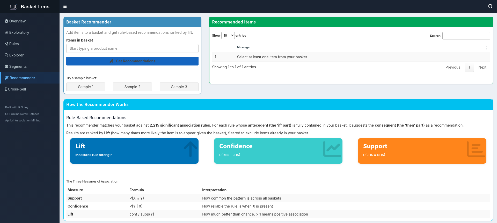

On arrival the results panel reads *"Select at least one item from your
basket."* — produced at `app.R:783-787`. The handler runs at startup because of
`ignoreNULL = FALSE` (`app.R:830`), finds an empty basket, and returns the
message rather than an error.

## With a basket loaded

Here is the same screen after five items from a real invoice are added:

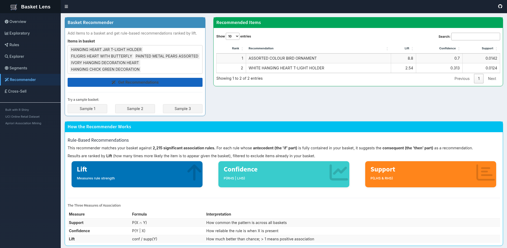

Basket: `HANGING HEART JAR T-LIGHT HOLDER`, `FILIGRIS HEART WITH BUTTERFLY`,
`PAINTED METAL PEARS ASSORTED`, `IVORY HANGING DECORATION HEART`,
`HANGING CHICK GREEN DECORATION`.

| Rank | Recommendation | Lift | Confidence | Support |
|---|---|---:|---:|---:|
| 1 | ASSORTED COLOUR BIRD ORNAMENT | 8.80 | 0.700 | 0.0142 |
| 2 | WHITE HANGING HEART T-LIGHT HOLDER | 2.54 | 0.313 | 0.0124 |

**How the three numbers on each row are calculated.** They are not recomputed
for your basket — they are the stored quality measures of the rule that fired,
copied straight out of `quality(d$sig)` and rounded for display
(`app.R:805-811`):

```r
rec <- data.frame(
  Recommendation = RHS_ITEM[fires],                  # L806  consequent of the firing rule
  Confidence     = round(QUAL$confidence[fires], 3), # L807  3 dp
  Lift           = round(QUAL$lift[fires], 2),       # L808  2 dp
  Support        = round(QUAL$support[fires], 4),    # L809  4 dp
  stringsAsFactors = FALSE
)
```

So "Confidence 0.700" means *historically*, across all 18,273 baskets, 70% of
the baskets containing that rule's antecedent also contained the recommendation.
It is a property of the mined rule, not a prediction scored against your five
selected items. `Rank` (`app.R:822`) is simply the row position after sorting by
lift.

Read row 1 as: *of all baskets containing this antecedent, 70% also contained
ASSORTED COLOUR BIRD ORNAMENT, which is 8.8× more often than baskets in general
contain it.* Both suggestions are hanging/ornamental decorations — the rule set
has correctly identified the theme of the basket.

## The controls

| Control | id | Code | Notes |
|---|---|---|---|
| Items in basket | `recom_items` | `app.R:321-326` | `selectizeInput`, multiple, max 20 items |
| Get Recommendations | `recom_go` | `app.R:327` | triggers `app.R:772` |
| Sample 1 / 2 / 3 | `recom_s1/2/3` | `app.R:332-337` | handlers at `app.R:832/844/856` |

The dropdown is populated **server-side** (`app.R:460-466`):

```r
choices <- sort(unique(d$retail$Item))
updateSelectizeInput(session, "recom_items", choices = choices, server = TRUE)
```

`server = TRUE` matters: with 3,765 product names, sending the whole list to the
browser would bloat the page, so selectize queries the server as you type.

The **Sample** buttons draw a real basket from `transactions.rds` rather than
inventing one. Each uses a fixed seed, so they are reproducible:

| Button | Seed | Basket size filter | Line |
|---|---|---|---|
| Sample 1 | `set.seed(7)` | 3-8 items | `app.R:832` |
| Sample 2 | `set.seed(42)` | 3-8 items | `app.R:844` |
| Sample 3 | `set.seed(99)` | 4-10 items | `app.R:856` |

Each takes the first 5 items of the sampled basket
(`basket[1:min(5, length(basket))]`).

## The recommendation algorithm

**Code:** `observeEvent(input$recom_go, ...)` at `app.R:772-830`. This is the
same logic as `recommend()` in `R/05_segments_and_recommendations.R:106-118`,
reimplemented in the app so it can run against live input.

```r
LHS_LIST <- as(lhs(sig), "list")            # antecedent of every rule, as a list
RHS_ITEM <- unlist(as(rhs(sig), "list"))    # consequent of every rule
QUAL     <- quality(sig)

fires <- vapply(LHS_LIST, function(l) all(l %in% basket), logical(1))
```

Step by step:

1. **Fire test** — a rule fires only if its *entire* antecedent is inside your
   basket (`all(l %in% basket)`). Partial matches do not count.
2. **Collect** the consequents of every firing rule with their confidence, lift
   and support.
3. **Drop items you already have** — `rec[!rec$Recommendation %in% basket, ]`.
   A recommender that suggests what is already in the trolley is useless.
4. **Rank by lift descending** — `rec[order(-rec$Lift), ]`.
5. **Deduplicate** — `rec[!duplicated(rec$Recommendation), ]`. Several rules can
   point at the same product; only its best-lift rule survives.
6. **Top 10**, then add a `Rank` column.

There are four distinct failure messages, and each is a different situation —
worth knowing which one you are looking at:

| Message | Line | Meaning |
|---|---|---|
| "Rules not loaded. Run the pipeline first." | `app.R:775` | `rules_significant.rds` missing |
| "Select at least one item from your basket." | `app.R:783` | empty basket |
| "No rules fired for this combination of items." | `app.R:796` | no rule's antecedent is fully contained |
| "All recommendations are already in your basket!" | `app.R:814` | rules fired, but step 3 emptied the list |

The third is common and is not a defect: with only 2,215 rules covering 3,765
products, most arbitrary baskets match nothing. Ranking by **lift** rather than
confidence is also a deliberate choice — confidence alone would keep suggesting
WHITE HANGING HEART T-LIGHT HOLDER to everybody, because it is in 12% of
baskets to begin with. Lift divides that popularity out.

## The "How the Recommender Works" panel

`app.R:344-370` — static explanatory content, not computed. The three coloured
boxes (Lift / Confidence / Support) are `renderValueBox` calls returning fixed
strings at `app.R:762-770`; they are labels, not readouts.

⚠️ The sentence "matches your basket against **2,215 significant association
rules**" at `app.R:346` is **hard-coded text**. Re-run the pipeline with a
different support threshold and this number will silently be wrong while the
Overview KPI beside it updates correctly. The same hard-coding appears at
`app.R:256` as the `max` of the Max-results input. Both should read
`length(d$sig)`.

---

# Tab 7 — Cross-Sell

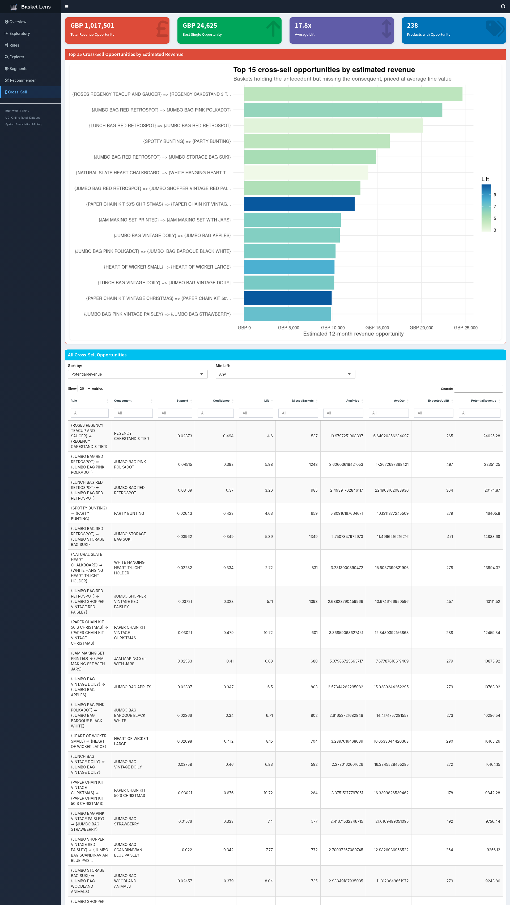

The tab that converts statistics into pounds. Layout at `app.R:375-412`; all
figures come from `output/tables/05_cross_sell_best_rule_per_product.csv`,
built in `R/05_segments_and_recommendations.R:150-200`.

## The four KPI boxes (Cross-Sell)

| Box | Value | Code | Computation |
|---|---|---|---|
| Total Revenue Opportunity | GBP 1,017,501 | `app.R:872` | `sum(cs_best$PotentialRevenue)` |
| Best Single Opportunity | GBP 24,625 | `app.R:885` | `max(PotentialRevenue)` |
| Average Lift | 17.8x | `app.R:898` | `mean(cs_best$Lift)` |
| Products with Opportunity | 238 | `app.R:908` | `nrow(cs_best)` |

**How each box is calculated.** All four read the same 238-row CSV; the app adds
only an aggregate and a format:

```r
total <- sum(d$cs_best$PotentialRevenue, na.rm = TRUE)                    # L878
paste0("GBP ", format(round(total), big.mark = ","))                      # L880 -> "GBP 1,017,501"

top <- head(arrange(d$cs_best, desc(PotentialRevenue)), 1)                # L891
paste0("GBP ", format(round(top$PotentialRevenue), big.mark = ","))       # L893 -> "GBP 24,625"

avg <- round(mean(d$cs_best$Lift, na.rm = TRUE), 1)                       # L904
paste0(avg, "x")                                                          # L905 -> "17.8x"

valueBox(nrow(d$cs_best), "Products with Opportunity", ...)               # L914 -> 238
```

Exact underlying values: total = 1,017,501.25; best single = 24,625.28; mean
lift = 17.767 → 17.8; rows = 238. `na.rm = TRUE` matters — a consequent whose
`AvgPrice` failed to join would produce `NA`, and the sum would otherwise
collapse to `NA` rather than skipping it.

**Why "238 products" and not 2,215 rules.** `cs_best` holds one row per
*consequent product*, after the deduplication described below. 2,215 rules point
at 238 distinct consequents.

**Why Average Lift is 17.8x here but mean lift is 12.97 on the Rules tab.** Two
different populations, both correct. The Rules tab averages all 2,215 rules;
this box averages the 238 rules that survived best-per-product deduplication.
Keeping only each product's strongest rule selects for high lift, so the mean
rises. If you are asked about the discrepancy, that is the answer.

## The opportunity formula

This is the only place on the dashboard where a number is *modelled* rather than
counted, so it is the most important derivation in the project.

**Definition of each quantity, in words:**

| Quantity | What it means |
|---|---|
| `MissedBaskets` | baskets that historically bought the antecedent **but not** the consequent |
| `AvgPrice` | that consequent product's mean unit price across its line items |
| `AvgQty` | that consequent product's mean units per line item |
| `ExpectedUplift` | missed baskets that *would* convert if the rule's historical hit-rate held when prompted |
| `PotentialRevenue` | the money those conversions would be worth over the 12 months of data |

**The chain, per rule** (`R/05_...R:162-177`), with N = 18,273:

```
MissedBaskets    = round( (coverage - support) x N )
ExpectedUplift   = MissedBaskets x Confidence
PotentialRevenue = round( ExpectedUplift x AvgPrice x AvgQty, 2 )
```

**Step 1 — price the consequent** (`R/05_...R:151-154`):

```r
price <- retail |>
  dplyr::group_by(Item) |>
  dplyr::summarise(AvgPrice = mean(UnitPrice),   # L153  unweighted mean over line items
                   AvgQty   = mean(Quantity),    # L154
                   .groups  = "drop")
```

Both are **unweighted means over line items**, not revenue-weighted averages. So
`AvgPrice × AvgQty` is "the average line of this product", worth about GBP 93
for the cakestand. It is not the same as revenue ÷ units (12.68 for the same
product on the Exploratory tab) — different definitions, both correct, and worth
knowing which one you are quoting.

**Step 2 — count the missed baskets without scanning any basket**
(`R/05_...R:162-168`):

```r
N     <- length(trans)                             # L157  18,273
q     <- quality(rules_all)                        # L158

value_df <- data.frame(
  Rule          = labels(rules_all),               # L163
  Consequent    = unlist(as(rhs(rules_all), "list")),  # L164
  Support       = round(q$support, 5),             # L165
  Confidence    = round(q$confidence, 3),          # L166
  Lift          = round(q$lift, 2),                # L167
  MissedBaskets = round((q$coverage - q$support) * N)  # L168  <-- the trick
)
```

`coverage` is supp(LHS) and `support` is supp(LHS ∪ RHS), so
`coverage − support` is exactly the fraction of baskets that took the antecedent
and skipped the consequent. The script says so itself at `R/05_...R:160-161`:

> *"No basket scan needed: coverage is supp(LHS) and support is supp(LHS ∪ RHS),
> so baskets holding the LHS but missing the RHS = (coverage − support) × N."*

**Step 3 — join the price and monetise** (`R/05_...R:170-177`):

```r
  dplyr::left_join(price, by = c("Consequent" = "Item")) |>   # L170
  dplyr::mutate(
    ExpectedUplift   = MissedBaskets * Confidence,                     # L173
    PotentialRevenue = round(ExpectedUplift * AvgPrice * AvgQty, 2),   # L174
    ExpectedUplift   = round(ExpectedUplift)                           # L175  rounded AFTER
  ) |>
  dplyr::arrange(dplyr::desc(PotentialRevenue))                        # L177
```

**Worked example — the top row, GBP 24,625.28:**

Rule: `{ROSES REGENCY TEACUP AND SAUCER} => {REGENCY CAKESTAND 3 TIER}`

| Step | Quantity | Value | Where it comes from |
|---|---|---:|---|
| — | support | 0.02873 | `q$support`, `05_...R:165` |
| — | confidence | 0.494 | `q$confidence`, `05_...R:166` |
| — | coverage | 0.05816 | `q$coverage` (= support ÷ confidence) |
| 2 | coverage − support | 0.02943 | fraction that missed the cakestand |
| 2 | × N = 18,273 → round | **537** | `MissedBaskets` |
| 3 | 537 × 0.494 | **265.278** | `ExpectedUplift`, unrounded |
| 1 | AvgPrice | 13.9797 | `mean(UnitPrice)` for the cakestand |
| 1 | AvgQty | 6.6402 | `mean(Quantity)` for the cakestand |
| 3 | 265.278 × 13.9797 × 6.6402 | **24,625.28** | `PotentialRevenue` ✓ |
| 3 | round(265.278) | 265 | `ExpectedUplift` as displayed |

In plain terms: 537 baskets bought the teacup and saucer without the cakestand;
if the rule's 49.4% success rate held when prompted, 265 of them would convert,
and each conversion is worth about GBP 93 (13.98 × 6.64).

**Three rounding details that will bite you if you recompute by hand:**

1. **The displayed uplift is not the one used.** `PotentialRevenue` is computed
   on line 174 from the *unrounded* 265.278; only line 175 rounds the column to
   265. Recomputing with 265 gives GBP 24,599.48 — GBP 26 short. The table is
   right; the hand calculation is using a rounded input.
2. **Confidence is rounded before it is used.** `Confidence` is rounded to 3 dp
   on line 166 and that rounded value feeds line 173, so the uplift carries a
   small deliberate approximation.
3. **`MissedBaskets` uses full-precision quality, not the printed values.**
   Recomputing from the displayed 0.02873 and 0.494 gives 537.7 → 538, one more
   than the 537 in the table, because the real coverage has more digits than the
   five shown.

None of these are errors — they are what happens when a table rounds for display
and the arithmetic runs at full precision. Say that plainly if the recomputation
is put to you.

## The double-counting problem, and how it was handled

This is the most defensible piece of reasoning in the project, and it is worth
knowing because the honest number is much smaller than the flattering one.

Summing `PotentialRevenue` over all 2,215 rules gives **GBP 7,553,161** — which
would be 78% of total annual revenue, obviously absurd. Rules overlap heavily:
dozens share a consequent and would fire on the same basket, so the same missed
sale is counted many times over.

The fix (`R/05_...R:188-194`) keeps, for each consequent product, only its
single best rule:

```r
best_per_consequent <- value_df |>
  group_by(Consequent) |>
  slice_max(PotentialRevenue, n = 1, with_ties = FALSE) |>
  ungroup()
```

| Estimate | Value | Status |
|---|---:|---|
| Naive sum over all 2,215 rules | GBP 7,553,161 | upper bound, double-counted |
| **Best rule per consequent (238 products)** | **GBP 1,017,501** | the figure shown |
| Top 20 of those products |  GBP 255,319 | 25.1% of the total |

GBP 1.02M is ~10.5% of the GBP 9.66M actual revenue — a plausible cross-sell
headroom rather than a fantasy.

**Still read it as a ceiling, not a forecast.** The model assumes every prompted
customer converts at exactly the rule's historical confidence, that prompting
adds sales rather than shifting them, and that average price and quantity hold.
None of those are guaranteed. It is the size of the prize if execution were
perfect.

## Top 15 Cross-Sell Opportunities  *(static image)*

**Code:** `show_fig("15_cross_sell_opportunity_value.png")` at `app.R:385`.
**Produced by:** `R/05_...R:203-216` — bar length = PotentialRevenue,
fill = Lift.

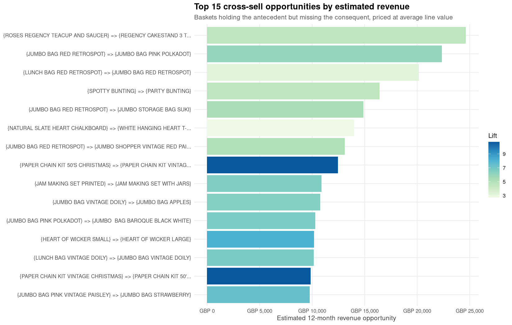

**What it says, and why this is the tab that matters.** Compare this list with
the Top-20-by-lift chart on the Rules tab: **not a single herb marker appears
here.** Once you weight by money, the actionable opportunities are teacups and
cakestands, jumbo bags, bunting, and Christmas paper chains.

The colour scale carries the second lesson. The two darkest bars (highest lift,
~10.7) are the PAPER CHAIN KIT pair, yet they rank 8th and 14th by revenue. The
longest bar — the cakestand at GBP 24,625 — has a lift of only 4.6. **High lift
and high value are largely independent**, and ranking by lift alone would have
sent the merchandising team after the wrong products.

## All Cross-Sell Opportunities (table)

**Code:** controls at `app.R:392-406`, `renderDT` at `app.R:918-948`.

| Control | id | Options |
|---|---|---|
| Sort by | `cs_sort` | PotentialRevenue (default), Lift, Confidence, MissedBaskets |
| Min Lift | `cs_minlift` | Any (default), 1.5, 2, 3, 5, 10 |

The table shows all **238** rows of `cs_best` — the chart above is just its top
15. Long `Rule` strings are truncated to 75 characters and `Consequent` to 40
for display (`app.R:934-941`); the underlying values are untouched.

The first rows, exactly as rendered:

| Rule | Support | Conf | Lift | Missed | AvgPrice | AvgQty | Uplift | Revenue |
|---|---:|---:|---:|---:|---:|---:|---:|---:|
| {ROSES REGENCY TEACUP AND SAUCER} ⇒ {REGENCY CAKESTAND 3 TIER} | 0.02873 | 0.494 | 4.60 | 537 | 13.98 | 6.64 | 265 | 24,625.28 |
| {JUMBO BAG RED RETROSPOT} ⇒ {JUMBO BAG PINK POLKADOT} | 0.04515 | 0.398 | 5.98 | 1,248 | 2.61 | 17.27 | 497 | 22,351.25 |
| {LUNCH BAG RED RETROSPOT} ⇒ {JUMBO BAG RED RETROSPOT} | 0.03169 | 0.370 | 3.26 | 985 | 2.49 | 22.20 | 364 | 20,174.87 |
| {SPOTTY BUNTING} ⇒ {PARTY BUNTING} | 0.02643 | 0.423 | 4.63 | 659 | 5.81 | 10.13 | 279 | 16,405.80 |
| {JUMBO BAG RED RETROSPOT} ⇒ {JUMBO STORAGE BAG SUKI} | 0.03962 | 0.349 | 5.39 | 1,349 | 2.75 | 11.50 | 471 | 14,888.68 |

Rows 1 and 2 illustrate the two routes to the same outcome: the cakestand
converts *fewer* baskets (265 vs 497) but each is worth GBP 93 against GBP 45,
so it still wins. Volume and value both matter, and this table lets you sort by
either.

---

# Part 8 — Formula reference

Everything the dashboard computes, in one place. `N` = 18,273 baskets.

## The three association measures

| Measure | Formula | Range | Reading |
|---|---|---|---|
| **Support** | supp(X) = count(X) / N | 0-1 | how common the pattern is overall |
| **Confidence** | conf(X⇒Y) = supp(X ∪ Y) / supp(X) = P(Y\|X) | 0-1 | how often the rule is right when it fires |
| **Lift** | lift(X⇒Y) = conf(X⇒Y) / supp(Y) | 0-∞ | times better than chance; 1 = independent |
| **Coverage** | cov(X⇒Y) = supp(X) | 0-1 | how often the rule applies at all |
| **Count** | count = supp(X ∪ Y) × N | integer | absolute baskets |

Lift is symmetric — lift(X⇒Y) = lift(Y⇒X) — while confidence is not. That is why
you see mirrored pairs like the two PAPER CHAIN KIT rules with identical lift
(10.72) but different confidence (0.479 and 0.676).

## The Apriori property

> Every subset of a frequent itemset is itself frequent.

Equivalently: if an itemset is infrequent, every superset of it is infrequent
too, and can be pruned without testing. This is what makes the search tractable
— and, as the threshold-sensitivity chart shows, it is why support is a far
more powerful lever than confidence.

Frequent itemsets found at support ≥ 0.01
(`output/tables/03_frequent_itemset_counts.csv`):

| Itemset size | Count |
|---|---:|
| 1 | 898 |
| 2 | 1,192 |
| 3 | 389 |
| 4 | 45 |

The rise from size 1 to 2 and the collapse after is the pruning working. Of the
3,765 products, only 898 clear 1% support on their own; `maxlen = 4` caps the
search there.

Rules by total size (LHS + RHS): 909 of size 2, 1,126 of size 3, 180 of size 4.

## Statistical significance

For each rule, a 2×2 contingency table of LHS present/absent × RHS
present/absent, tested with **Fisher's exact test**, then corrected across all
rules with **Benjamini-Hochberg** to control the false discovery rate:

```r
quality(rules)$fishersPValue <- interestMeasure(rules, "fishersExactTest",
                                                transactions = trans)
quality(rules)$pAdjusted     <- p.adjust(quality(rules)$fishersPValue, "BH")
sig_rules <- subset(rules, pAdjusted < 0.05)
```

With 2,215 tests, an uncorrected 5% threshold would admit ~111 false positives
by chance alone; BH controls that. In this dataset all 2,215 rules passed.

## The cross-sell chain

```
MissedBaskets    = (coverage - support) x N
ExpectedUplift   = MissedBaskets x confidence
PotentialRevenue = ExpectedUplift x AvgPrice x AvgQty
Total            = sum over the best rule per consequent product
```

---

# Part 9 — Things worth knowing (quirks and gotchas)

Collected from reading the code and driving the running app. The first one will
cost you an hour if you hit it unaware.

### ⚠️ 1. Launching the app can silently re-run the entire pipeline

`app.R:6` sets `options(shiny.autoload.r = FALSE)`, but that line executes
*after* Shiny has already decided whether to auto-load `R/*.R`. Running
`shiny::runApp(".")` therefore sources all five pipeline scripts before the app
starts — re-reading the 46 MB Excel file and rewriting `output/`. Verified
directly:

| Invocation | Sources `R/*.R`? |
|---|---|
| `shiny::runApp(".")` | **yes** — full pipeline re-runs |
| `options(shiny.autoload.r = FALSE); shiny::runApp(".")` | no |

**Launch it this way:**

```r
options(shiny.autoload.r = FALSE)
shiny::runApp(".", port = 3838, launch.browser = FALSE)
```

A permanent fix is to move the option out of `app.R` into a `.Rprofile` at the
project root, where it is set before Shiny loads.

### ⚠️ 2. Two bar charts render grey with no legend

`seg_bar` (`app.R:711`) and `season_bar` (`app.R:736`) pass a named colour
vector into `scale_fill_manual()`, producing the names `Rules.primary` and
`Baskets.orange`, which never match the factor levels. Both charts lose their
colour coding and legend. Fix with `unname()` — see the Segments section for
the full explanation.

### ⚠️ 3. "UK Top Rules: 25" is not a rule count

Both Segments rule-count boxes show `nrow()` of a CSV that was deliberately
truncated to 25 rows. The real counts (2,661 and 375) are in the comparison
table beside them.

### ⚠️ 4. Explorer caps before it searches

Max results is applied to the lift-sorted rules *before* the keyword filter runs,
so a keyword search with the default cap of 300 only searches the top 300 rules.
Set Max results to 2215 first.

### ⚠️ 5. Two hard-coded rule counts

`app.R:256` (`max = 2215`) and `app.R:346` ("2,215 significant association
rules") are literals. Re-run the pipeline with different parameters and they go
stale while the Overview KPI updates. Both should be derived from `length(d$sig)`.

### 6. December 2011 is nine days, not a month

The data ends 2011-12-09. The short final bar on the monthly chart is a
truncated month, not a demand collapse.

### 7. The dataset has no Saturdays

The weekday × hour heatmap shows Mon-Fri and Sun. Saturday is absent from the
source data entirely.

### 8. p-value columns display as 0

Rounded to 5 decimals at `R/03_apriori.R:134`. The true values are far below
1e-5.

### 9. The top rules are a product family, not a behaviour

Every one of the top 20 rules by lift is a HERB MARKER combination — six
variants of one product sold as a set. Statistically valid, commercially inert.
This is precisely why the Cross-Sell tab ranks by revenue, and why no herb
marker appears in its top 15.

### 10. Static images ignore the controls next to them

Six panels are pre-rendered PNGs (see §0.2). Most notably, the Explorer's
network diagram and parallel-coordinates plot do not respond to its sliders.
They change only when `R/04_visualize_rules.R` is re-run.

### 11. The two segments were mined at different thresholds

UK at 1% support, International at 2% (`R/05_...R:45`). The rule counts are
therefore not directly comparable — the `MinSupport` column exists to keep that
visible.

### 12. Some International rules rest on ~37 baskets

At 2% support of 1,767 baskets, the minimum evidence behind a rule is about 35
transactions. Statistically admissible, commercially thin.

---

# Appendix A — Panel-to-code index

Every visible element, with the line that creates it.

| Tab | Panel / control | UI line | Server line | Data source |
|---|---|---|---|---|
| Overview | Baskets KPI | `app.R:173` | `app.R:471` | `retail_clean.rds` |
| Overview | Unique Products KPI | `app.R:174` | `app.R:478` | `retail_clean.rds` |
| Overview | Significant Rules KPI | `app.R:175` | `app.R:485` | `rules_significant.rds` |
| Overview | Total Revenue KPI | `app.R:176` | `app.R:492` | `retail_clean.rds` |
| Overview | Monthly Revenue Trend | `app.R:180` | `app.R:500` | `02_monthly_sales.csv` |
| Overview | Top 10 Products | `app.R:182` | `app.R:512` | `02_top50_items_by_frequency.csv` |
| Overview | Weekday × Hour heatmap | `app.R:186` | `app.R:526` | `retail_clean.rds` (live) |
| Overview | Top Countries | `app.R:188` | `app.R:538` | `02_by_country.csv` |
| Exploratory | Top-N frequency selector | `app.R:198` | — | — |
| Exploratory | Top-N frequency plot | `app.R:200` | `app.R:553` | `02_top50_items_by_frequency.csv` |
| Exploratory | Top-N revenue selector | `app.R:202` | — | — |
| Exploratory | Top-N revenue plot | `app.R:204` | `app.R:569` | `02_top50_items_by_revenue.csv` |
| Exploratory | Basket size histogram | `app.R:208` | `app.R:582` | `retail_clean.rds` (live) |
| Exploratory | Relative item frequency | `app.R:210` | static | `07_item_frequency_relative.png` |
| Rules | Threshold sensitivity | `app.R:221` | static | `08_threshold_sensitivity.png` |
| Rules | Rule Statistics | `app.R:223` | `app.R:599` | `rules_significant.rds` |
| Rules | Top 20 by lift | `app.R:231` | static | `14_top_rules_by_lift_bars.png` |
| Rules | Support vs confidence | `app.R:234` | static | `09_rules_scatter.png` |
| Rules | Table: By Lift | `app.R:238` | `app.R:616` | `03_top_rules_by_lift.csv` |
| Rules | Table: By Confidence | `app.R:239` | `app.R:623` | `03_top_rules_by_confidence.csv` |
| Rules | Table: By Support | `app.R:240` | `app.R:629` | `03_top_rules_by_support.csv` |
| Rules | Table: All Rules | `app.R:241` | `app.R:635` | `03_all_significant_rules.csv` |
| Explorer | Min Lift slider | `app.R:253` | `app.R:644` | — |
| Explorer | Min Confidence slider | `app.R:254` | `app.R:644` | — |
| Explorer | Min Support slider | `app.R:255` | `app.R:644` | — |
| Explorer | Max results | `app.R:256` | `app.R:644` | — |
| Explorer | Item keyword | `app.R:258` | `app.R:644` | — |
| Explorer | Apply Filters | `app.R:260` | `app.R:644` | — |
| Explorer | Filtered rules table | `app.R:264` | `app.R:670` | `rules_significant.rds` |
| Explorer | Association network | `app.R:268` | static | `11_rules_graph_top25_lift.png` |
| Explorer | Parallel coordinates | `app.R:272` | static | `13_rules_paracoord.png` |
| Segments | UK Baskets KPI | `app.R:281` | `app.R:683` | `retail_clean.rds` |
| Segments | Intl Baskets KPI | `app.R:282` | `app.R:689` | `retail_clean.rds` |
| Segments | UK Top Rules KPI | `app.R:283` | `app.R:695` | `05_top_rules_uk.csv` (row count) |
| Segments | Intl Top Rules KPI | `app.R:284` | `app.R:700` | `05_top_rules_international.csv` |
| Segments | Baskets & Rules bars | `app.R:288` | `app.R:711` | `05_segment_comparison.csv` |
| Segments | Comparison summary | `app.R:290` | `app.R:706` | `05_segment_comparison.csv` |
| Segments | UK rules table | `app.R:294` | `app.R:724` | `05_top_rules_uk.csv` |
| Segments | Intl rules table | `app.R:296` | `app.R:730` | `05_top_rules_international.csv` |
| Segments | Season bars | `app.R:303` | `app.R:736` | `05_season_comparison.csv` |
| Segments | Festive-only rules | `app.R:308` | `app.R:750` | `05_festive_only_rules.csv` |
| Recommender | Item selector | `app.R:321` | `app.R:460` | `retail_clean.rds` |
| Recommender | Get Recommendations | `app.R:327` | `app.R:772` | `rules_significant.rds` |
| Recommender | Sample 1 / 2 / 3 | `app.R:332-337` | `app.R:832/844/856` | `transactions.rds` |
| Recommender | Results table | `app.R:341` | `app.R:775-829` | computed live |
| Recommender | Lift/Conf/Supp boxes | `app.R:353-355` | `app.R:762-770` | static labels |
| Cross-Sell | Total Opportunity KPI | `app.R:377` | `app.R:872` | `05_cross_sell_best_rule_per_product.csv` |
| Cross-Sell | Best Single KPI | `app.R:378` | `app.R:885` | same |
| Cross-Sell | Average Lift KPI | `app.R:379` | `app.R:898` | same |
| Cross-Sell | Products KPI | `app.R:380` | `app.R:908` | same |
| Cross-Sell | Top 15 chart | `app.R:385` | static | `15_cross_sell_opportunity_value.png` |
| Cross-Sell | Sort by | `app.R:392` | `app.R:918` | — |
| Cross-Sell | Min Lift | `app.R:402` | `app.R:918` | — |
| Cross-Sell | Opportunities table | `app.R:408` | `app.R:918` | `05_cross_sell_best_rule_per_product.csv` |

# Appendix B — Which script writes which file

| Script | Figures | Tables | Objects |
|---|---|---|---|
| `R/01_load_clean.R` | — | `01_data_quality_audit`, `01_cleaning_summary` | `retail_clean.rds/.csv` |
| `R/02_eda.R` | `01`-`06` | `02_top50_items_by_frequency`, `02_top50_items_by_revenue`, `02_basket_size_stats`, `02_monthly_sales`, `02_by_country` | — |
| `R/03_apriori.R` | `07`, `08` | `03_frequent_itemset_counts`, `03_top30_frequent_itemsets`, `03_top_multi_item_itemsets`, `03_all_significant_rules`, `03_top_rules_by_{lift,confidence,support}`, `03_threshold_sensitivity`, `03_transactions_summary.txt` | `transactions.rds`, `rules.rds`, `rules_significant.rds`, `itemsets.rds` |
| `R/04_visualize_rules.R` | `09`-`14` | `04_rules_leading_to_top_item`, `04_rules_from_top_item` | — |
| `R/05_segments_and_recommendations.R` | `15` | `05_segment_comparison`, `05_top_rules_{uk,international,prechristmas,restofyear}`, `05_season_comparison`, `05_festive_only_rules`, `05_recommender_demo`, `05_cross_sell_opportunity_value`, `05_cross_sell_best_rule_per_product` | — |

Figures `10` (two-key plot) and `12` (grouped matrix) are generated by
`04_visualize_rules.R` but are **not displayed anywhere in the dashboard** — they
exist in `output/figures/` only.

---

# Appendix C — "How did you get this number?" quick index

Point at any number on the screen, find its row here, read the formula, quote
the line. The **Derived in** column links to the section that shows the code.

## Overview tab

| Number on screen | Value | One-line formula | Code | Derived in |
|---|---:|---|---|---|
| Baskets | 18,273 | `n_distinct(InvoiceNo)` after cleaning | `app.R:474` | [KPI 1](#kpi-1--baskets--18273) |
| Unique Products | 3,765 | `n_distinct(Item)`, `Item` = most frequent description per `StockCode` | `app.R:481` | [KPI 2](#kpi-2--unique-products--3765) |
| Significant Rules | 2,215 | `length()` of the rule set after lift, redundancy and BH filters | `app.R:488` | [KPI 3](#kpi-3--significant-rules--2215) |
| Total Revenue | GBP 9,658,813 | `Σ (Quantity × UnitPrice)` over 515,784 cleaned lines | `app.R:495` ← `01:80` | [KPI 4](#kpi-4--total-revenue--gbp-9658813) |
| Monthly bar height | e.g. Nov = 1,411,515 | `sum(Revenue)` grouped by `floor_date(Date,"month")` | `02_eda.R:75` | [Monthly Revenue Trend](#monthly-revenue-trend) |
| Monthly transactions | e.g. Nov = 2,567 | `n_distinct(InvoiceNo)` per month | `02_eda.R:76` | same |
| Top-10 bar length | e.g. 2,246 | `count(Item)` on the deduplicated table | `02_eda.R:12` | [Top 10 Products](#top-10-products-by-frequency) |
| Support column | e.g. 0.1229 | `Baskets / n_distinct(InvoiceNo)` | `02_eda.R:13` | same |
| Heatmap tile | e.g. 300 | `distinct(InvoiceNo, Weekday, Hour)` then `count(Weekday, Hour)` | `app.R:529-530` | [Trading Rhythm](#trading-rhythm-weekday--hour) |
| Country revenue | e.g. UK 8,169,434 | `sum(Revenue)` grouped by `Country` | `02_eda.R:108` | [Top Countries](#top-countries-by-revenue) |
| Country share | e.g. 84.6% | `Revenue / sum(Revenue)` over all 38 countries | `02_eda.R:110` | same |

## Exploratory tab

| Number on screen | Value | One-line formula | Code | Derived in |
|---|---:|---|---|---|
| Frequency bar | e.g. 1,152 | `count(Item)`, top *n* rows | `02_eda.R:12` | [Top Products by Basket Frequency](#top-products-by-basket-frequency-interactive) |
| Revenue bar | e.g. 165,394 | `sum(Revenue)` grouped by `Item` | `02_eda.R:33` | [Top Products by Revenue](#top-products-by-revenue-interactive) |
| Units column | e.g. 13,048 | `sum(Quantity)` grouped by `Item` | `02_eda.R:33` | same |
| Histogram bar | count of baskets | `count(InvoiceNo)` binned at width 2 | `app.R:584-588` | [Basket Size Distribution](#basket-size-distribution) |
| Subtitle mean | 28.2 | `mean(BasketSize)` = 515,784 ÷ 18,273 | `app.R:585` | same |
| Subtitle median | 17 | `median(BasketSize)` | `app.R:586` | same |
| Stats table (Q1/Q3/P95) | 8 / 30 / 78.4 | `quantile(BasketSize, .25/.75/.95)` | `02_eda.R:63-69` | same |

## Rules tab

| Number on screen | Value | One-line formula | Code | Derived in |
|---|---:|---|---|---|
| Sensitivity grid cell | e.g. 2,229 | `length()` of a fresh Apriori run at that (support, confidence) | `03_apriori.R:150` | [Threshold sensitivity](#how-do-rule-counts-react-to-threshold-pairs--static-image) |
| Total rules | 2,215 | `length(d$sig)` | `app.R:607` | [Rule Statistics](#rule-statistics) |
| Support range | 0.0100 – 0.0451 | `min/max(quality(sig)$support)` | `app.R:609` | same |
| Confidence range | 0.300 – 0.968 | `min/max(quality(sig)$confidence)` | `app.R:610` | same |
| Lift range / mean | 2.47 – 75.47 / 12.97 | `min/max/mean(quality(sig)$lift)` | `app.R:611-612` | same |
| `support` in a rule table | e.g. 0.04515 | count(X ∪ Y) / 18,273 | `arules`, `03_apriori.R:80` | same |
| `confidence` | e.g. 0.67845 | supp(X ∪ Y) / supp(X) | `arules` | same |
| `coverage` | e.g. 0.06655 | supp(X) | `arules` | same |
| `lift` | e.g. 5.98 | confidence ÷ supp(Y) | `arules` | same |
| `count` | e.g. 825 | support × 18,273 | `arules` | same |
| `pAdjusted` (shows 0) | < 1e-5 | BH-adjusted Fisher exact p, rounded to 5 dp | `03_apriori.R:106`, `121` | [Rule Tables](#rule-tables-four-tabs) |

## Explorer tab

| Number on screen | Value | One-line formula | Code | Derived in |
|---|---:|---|---|---|
| Row count after Apply | ≤ Max results | logical mask on `quality(d$sig)`, then `head(sort(by="lift"), max)` | `app.R:644-678` | [What happens when you press Apply](#what-happens-when-you-press-apply) |
| Displayed measures | as mined | `arules::DATAFRAME()` then `round(x, 4)` | `app.R:662-664` | same |

## Segments tab

| Number on screen | Value | One-line formula | Code | Derived in |
|---|---:|---|---|---|
| UK Baskets | 16,506 | `n_distinct(InvoiceNo[Country == "United Kingdom"])` | `app.R:685` | [Segments KPIs](#the-four-kpi-boxes-segments) |
| International Baskets | 1,767 | `n_distinct(InvoiceNo[Country != "United Kingdom"])` | `app.R:691` | same |
| UK / Intl "Top Rules" | 25 / 25 | `nrow()` of a CSV truncated to 25 — **not a rule count** | `app.R:697`, `702` | same |
| `Baskets` column | 16,506 / 1,767 | `length(x$trans)` per segment | `05_...R:58` | [Segment Comparison](#segment-comparison-summary) |
| `Products` column | 3,760 / 2,778 | `ncol(x$trans)` per segment | `05_...R:59` | same |
| `Rules` column | 2,661 / 375 | `length()` of a fresh per-segment Apriori run | `05_...R:61` | same |
| `MeanLift` / `MaxLift` | 13.13 / 72.66 | `mean` / `max` of that segment's lifts | `05_...R:62-65` | same |
| Season `Baskets` | 6,139 / 12,134 | `length(tr)` after filtering on `month ∈ {9,10,11}` | `05_...R:90` | [Seasonal Analysis](#seasonal-analysis) |
| Season `Rules` | 5,174 / 2,296 | `length(r)` from a per-season Apriori run at support 0.01 | `05_...R:90` | same |
| Festive-only rules | 25 shown | `labels(fest)` not in `labels(rest)`, top 25 by lift | `05_...R:100` | same |

## Recommender tab

| Number on screen | Value | One-line formula | Code | Derived in |
|---|---:|---|---|---|
| Rank | 1, 2, 3 … | row position after `order(-Lift)` and dedup | `app.R:819-822` | [The recommendation algorithm](#the-recommendation-algorithm) |
| Lift / Confidence / Support | e.g. 8.80 / 0.700 / 0.0142 | the firing rule's stored quality, rounded 2/3/4 dp | `app.R:807-809` | [With a basket loaded](#with-a-basket-loaded) |
| "2,215 significant rules" text | 2,215 | **hard-coded string**, not computed | `app.R:346` | [gotcha 5](#part-9--things-worth-knowing-quirks-and-gotchas) |

## Cross-Sell tab

| Number on screen | Value | One-line formula | Code | Derived in |
|---|---:|---|---|---|
| Total Revenue Opportunity | GBP 1,017,501 | `sum(PotentialRevenue)` over the 238 best-per-product rules | `app.R:878` | [Cross-Sell KPIs](#the-four-kpi-boxes-cross-sell) |
| Best Single Opportunity | GBP 24,625 | `max(PotentialRevenue)` | `app.R:891` | same |
| Average Lift | 17.8x | `mean(cs_best$Lift)` — 238 rules, not 2,215 | `app.R:904` | same |
| Products with Opportunity | 238 | `nrow(cs_best)` = distinct consequents | `app.R:914` | same |
| `MissedBaskets` | e.g. 537 | `round((coverage − support) × 18,273)` | `05_...R:168` | [The opportunity formula](#the-opportunity-formula) |
| `AvgPrice` | e.g. 13.98 | `mean(UnitPrice)` for the consequent product | `05_...R:153` | same |
| `AvgQty` | e.g. 6.64 | `mean(Quantity)` for the consequent product | `05_...R:154` | same |
| `ExpectedUplift` | e.g. 265 | `MissedBaskets × Confidence`, rounded after use | `05_...R:173`, `175` | same |
| `PotentialRevenue` | e.g. 24,625.28 | `ExpectedUplift × AvgPrice × AvgQty` | `05_...R:174` | same |
| Naive total (not shown) | GBP 7,553,161 | `sum(PotentialRevenue)` over all 2,215 rules — double-counted | `05_...R:198` | [The double-counting problem](#the-double-counting-problem-and-how-it-was-handled) |

## Four sentences that answer most challenges

1. **"Where does revenue come from?"** — `Revenue = Quantity × UnitPrice`,
   created once at `R/01_load_clean.R:80` after eight cleaning filters; every
   money figure on the dashboard is a `sum()` of that one column.
2. **"Why 18,273 and not 25,900?"** — cancellations, non-positive quantities,
   admin stock codes and junk descriptions are dropped, then any basket left
   with a single item is removed because it carries no co-occurrence
   information (`R/01_load_clean.R:99-102`).
3. **"How is a rule scored?"** — support = both sides ÷ 18,273; confidence =
   support ÷ coverage; lift = confidence ÷ the consequent's own support. All
   three are computed by `arules::apriori()` at `R/03_apriori.R:80-88`.
4. **"Is the GBP 1.02M real?"** — it is a modelled ceiling, not a forecast:
   missed baskets × the rule's historical confidence × average line value, kept
   to one best rule per product to avoid double counting (`R/05_...R:188-193`).

---

*Screenshots captured from the live app; every figure and number verified
against the current contents of `data/processed/` and `output/`.*
